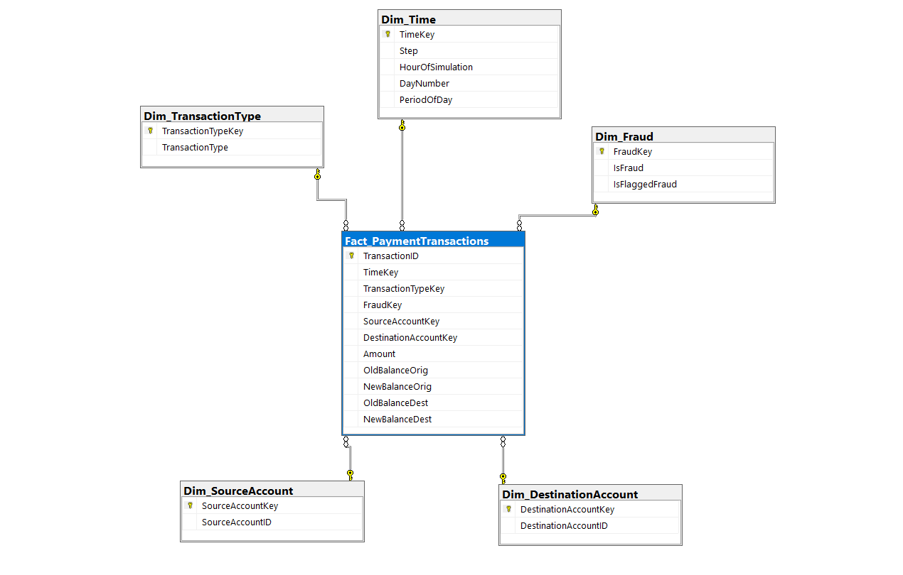

  # 🌟 Star Schema Architecture

  
  

 

## 📖 Overview

This project follows the Kimball Dimensional Modeling approach by implementing a Star Schema for payment transaction analytics. The design separates descriptive attributes into dimension tables while storing transactional measures inside a centralized fact table.

This dimensional model organizes enterprise payment transaction data to optimize analytical workloads by reducing query complexity, improving aggregation performance, and supporting business intelligence reporting.

---

## 🗺️ Entity Relationship Diagram

Below is the visual representation of the Star Schema architecture.

---

## 📊 Fact Table

**`Fact_PaymentTransactions`**

The Fact table stores the measurable business events occurring within the payment platform. Each record represents a single payment transaction and contains both financial measures and foreign key references to the associated dimensions.

### Measures
* Amount
* OldBalanceOrig
* NewBalanceOrig
* OldBalanceDest
* NewBalanceDest

### Foreign Keys
* TimeKey
* TransactionTypeKey
* FraudKey
* SourceAccountKey
* DestinationAccountKey

### Fact Table Grain
The grain of this table is **one row per payment transaction**. Maintaining this level of granularity enables accurate KPI calculations, reliable fraud analysis, transaction-level reporting, flexible business intelligence, and consistent machine learning feature extraction.

---

## 📐 Dimension Tables

### `Dim_Time`
Stores time-related information derived from the simulation step (Step, HourOfSimulation, DayNumber, PeriodOfDay).
**Business Usage:** Daily transaction trends, time-based filtering, fraud trend analysis, and executive reporting.

### `Dim_TransactionType`
Stores payment transaction categories (PAYMENT, CASH_OUT, CASH_IN, TRANSFER, DEBIT).
**Business Usage:** Transaction segmentation, payment channel analysis, and fraud analysis by transaction type.

### `Dim_Fraud`
Stores fraud classifications (IsFraud, IsFlaggedFraud).
**Business Usage:** Fraud reporting, Fraud KPIs, dashboard filters, and machine learning evaluation.

### `Dim_SourceAccount`
Stores unique sender account identifiers.
**Business Usage:** Customer behavior analysis, sender profiling, and fraud investigation.

### `Dim_DestinationAccount`
Stores unique receiver account identifiers.
**Business Usage:** Recipient analysis, network investigation, and suspicious account monitoring.

---

## 🔗 Relationship Cardinality

Every dimension has a **one-to-many (1:N)** relationship with the Fact table through surrogate keys. This relationship model minimizes redundancy while enabling efficient enterprise-scale analytical queries on more than 6 million payment transactions.

| Dimension | Relationship | Fact Table |
|---|:---:|---|
| `Dim_Time` | 1 → Many | `Fact_PaymentTransactions` |
| `Dim_TransactionType` | 1 → Many | `Fact_PaymentTransactions` |
| `Dim_Fraud` | 1 → Many | `Fact_PaymentTransactions` |
| `Dim_SourceAccount` | 1 → Many | `Fact_PaymentTransactions` |
| `Dim_DestinationAccount` | 1 → Many | `Fact_PaymentTransactions` |

---

## 🧠 Design Decisions

| Concept | Implementation Strategy |
|---|---|
| **Kimball Star Schema** | Selected over a Snowflake Schema to provide simpler SQL queries, faster aggregations, and better dashboard performance for analytical reporting. |
| **Surrogate Keys** | Each dimension uses surrogate integer keys instead of natural business keys for faster joins, improved referential integrity, simplified indexing, and better scalability. |
| **Separate Account Dimensions** | Sender and receiver accounts are isolated into separate dimensions to enable independent behavioral analysis, money movement tracking, and network investigation. |
| **Dedicated Time & Fraud Dimensions** | Time and Fraud attributes are split into dedicated dimensions to simplify time-series reporting, trend visualization, and KPI dashboard filtering. |

---

## 🚀 Benefits & Project Integration

The implemented Star Schema provides several critical business and technical advantages for the Enterprise FinTech Payment Intelligence Platform.

**Business & Technical Benefits:**
* Faster business reporting and improved operational monitoring.
* Reduced data redundancy and highly optimized SQL joins.
* Consistent KPI calculations and simplified dashboard development.

**Integration Across Phases:**
Every analytical component in this project retrieves data from this dimensional model, directly supporting:
* SQL Analytics & Advanced Reporting
* Power BI Dashboards
* Fraud Analytics & Business KPI Calculation
* Machine Learning Feature Engineering
* Explainable AI

---

## 📝 Conclusion

The Star Schema establishes a scalable, high-performance analytical foundation for the Enterprise FinTech Payment Intelligence Platform. By organizing payment transactions into a centralized Fact table and descriptive Dimension tables, the warehouse enables efficient SQL analytics, reliable business reporting, interactive Power BI dashboards, and machine learning workflows.