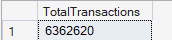
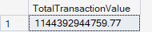
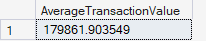
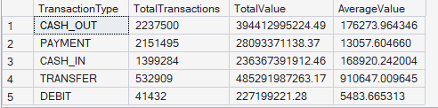
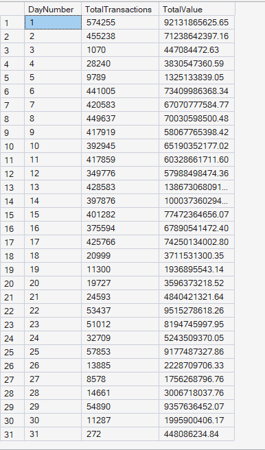
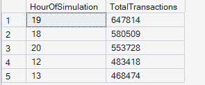
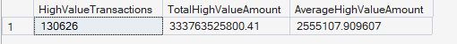

  # 💳 Payment Analytics Results

  
  

 

## 📖 Overview

This document presents the results of the SQL-based payment analytics performed on the Enterprise FinTech Payment Intelligence Platform. The analysis evaluates key payment performance metrics, transaction volume, transaction value, payment behavior, and transaction trends to provide actionable business insights.

---

## 📊 KPI 1: Total Transactions

**🎯 Business Objective:** Determine the total number of processed payment transactions.

**💻 SQL Query:** Implemented in `01_Payment_Analytics.sql`

**📈 SQL Output:**  

**🧠 Business Interpretation:** This KPI measures the overall transaction volume processed by the payment platform during the analysis period. It serves as the baseline metric for evaluating platform utilization and customer activity.

**💡 Key Insight:** The total transaction count represents the overall workload handled by the payment platform and forms the foundation for analyzing payment performance and customer behavior.

**✅ Business Recommendation:** Monitor total transaction volume regularly to identify unusual spikes or sudden declines that may indicate operational issues, seasonal demand, or potential system anomalies.

---

## 💰 KPI 2: Total Transaction Value

**🎯 Business Objective:** Calculate the total monetary value processed by the payment platform.

**💻 SQL Query:** Implemented in `01_Payment_Analytics.sql`

**📈 SQL Output:**  

**🧠 Business Interpretation:** This KPI measures the total amount of money processed through the platform and reflects the financial scale of payment operations.

**💡 Key Insight:** A high transaction value indicates significant payment activity and helps estimate the overall financial throughput of the platform.

**✅ Business Recommendation:** Track total transaction value over time to support financial forecasting, payment capacity planning, and revenue analysis.

---

## ⚖️ KPI 3: Average Transaction Value

**🎯 Business Objective:** Measure the average monetary value of processed transactions.

**💻 SQL Query:** Implemented in `01_Payment_Analytics.sql`

**📈 SQL Output:**  

**🧠 Business Interpretation:** The average transaction value indicates the typical amount processed per payment transaction and provides insight into customer payment behavior.

**💡 Key Insight:** Changes in the average transaction value may indicate shifts in customer purchasing patterns or transaction mix.

**✅ Business Recommendation:** Monitor average transaction value alongside transaction volume to identify changes in customer spending behavior and business performance.

---

## 🥧 KPI 4: Transaction Type Distribution

**🎯 Business Objective:** Analyze transaction activity across different payment transaction types.

**💻 SQL Query:** Implemented in `01_Payment_Analytics.sql`

**📈 SQL Output:**  

**🧠 Business Interpretation:** This analysis compares transaction volume, total payment value, and average payment value across different transaction types to understand payment preferences.

**💡 Key Insight:** Different transaction types contribute differently to overall platform activity and payment volume.

**✅ Business Recommendation:** Use transaction type analysis to optimize payment services, improve operational efficiency, and prioritize high-volume transaction categories.

---

## 📅 KPI 5: Daily Transaction Trends

**🎯 Business Objective:** Analyze transaction activity across simulation days.

**💻 SQL Query:** Implemented in `01_Payment_Analytics.sql`

**📈 SQL Output:**  

**🧠 Business Interpretation:** Daily transaction trends help identify changes in platform activity throughout the simulation period and reveal fluctuations in transaction demand.

**💡 Key Insight:** Daily monitoring enables early detection of abnormal transaction behavior and operational trends.

**✅ Business Recommendation:** Track daily transaction patterns continuously to support capacity planning, operational monitoring, and anomaly detection.

---

## 🕒 KPI 6: Hourly Transaction Trends

**🎯 Business Objective:** Analyze transaction activity across hourly time intervals.

**💻 SQL Query:** Implemented in `01_Payment_Analytics.sql`

**📈 SQL Output:**  

**🧠 Business Interpretation:** Hourly transaction analysis identifies how customer payment activity varies throughout the day.

**💡 Key Insight:** Peak usage hours can be identified for infrastructure planning and workload balancing.

**✅ Business Recommendation:** Allocate system resources efficiently during high-traffic hours to maintain platform performance and reduce transaction latency.

---

## 📈 KPI 7: Peak Transaction Hours

**🎯 Business Objective:** Identify the busiest transaction hours based on transaction volume.

**💻 SQL Query:** Implemented in `01_Payment_Analytics.sql`

**📈 SQL Output:**  

**🧠 Business Interpretation:** This KPI highlights the hours with the highest payment activity and identifies peak operational periods.

**💡 Key Insight:** Understanding peak transaction hours supports infrastructure optimization and service reliability.

**✅ Business Recommendation:** Schedule system maintenance during low-traffic periods and ensure sufficient infrastructure capacity during peak transaction hours.

---

## 🐳 KPI 8: Large Transaction Distribution

**🎯 Business Objective:** Analyze high-value transactions exceeding the defined threshold.

**💻 SQL Query:** Implemented in `01_Payment_Analytics.sql`

**📈 SQL Output:**  

**🧠 Business Interpretation:** This KPI evaluates the frequency and financial impact of high-value transactions processed by the platform.

**💡 Key Insight:** Large-value transactions represent significant financial exposure and require continuous monitoring for both operational and fraud management purposes.

**✅ Business Recommendation:** Implement enhanced monitoring and risk assessment for high-value transactions to improve fraud detection and financial risk management.