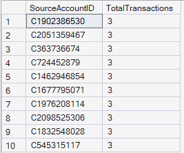
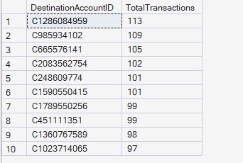
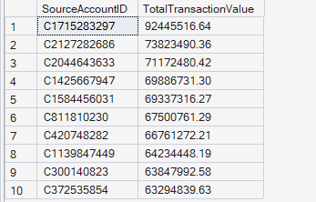
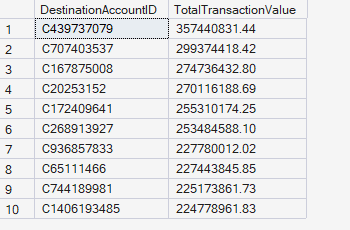
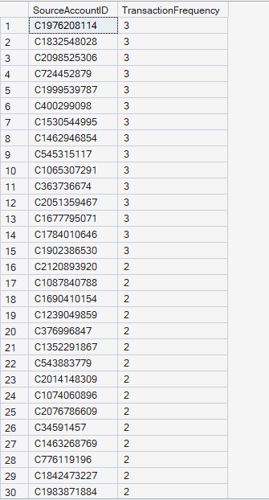
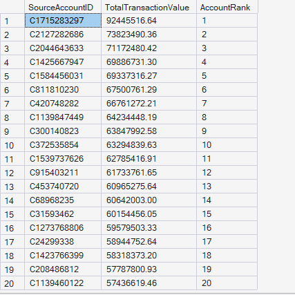
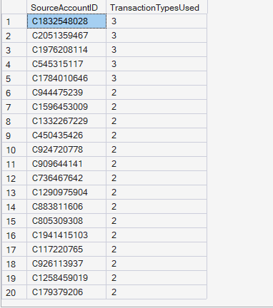

# Account Analytics Results

## Overview

This document presents the results of the **Account Analytics** module developed for the **Enterprise FinTech Payment Intelligence Platform**.

The analysis focuses on understanding customer account behavior by identifying the most active accounts, high-value accounts, transaction frequency patterns, account rankings, and multi-channel transaction usage.

---

# KPI 1: Top Source Accounts

## Business Objective

Identify the most active source accounts based on transaction count.

## SQL Output

## Business Interpretation

The most active source accounts executed three transactions each within the dataset, indicating that transaction activity is widely distributed across customers rather than concentrated among a few accounts.

## Key Insight

The payment platform exhibits highly decentralized customer activity, with no single source account dominating transaction volume.

## Business Recommendation

Continue monitoring transaction frequency over longer periods to identify unusual account activity that may indicate fraudulent or automated behavior.

---

# KPI 2: Top Destination Accounts

## Business Objective

Identify destination accounts receiving the highest number of incoming transactions.

## SQL Output

## Business Interpretation

The leading destination account received **113 transactions**, while several others received more than **100 transactions**, indicating that certain accounts consistently receive high volumes of payments.

## Key Insight

A relatively small group of destination accounts attracts significantly higher transaction activity than the rest of the platform.

## Business Recommendation

Monitor high-volume receiving accounts for merchant verification, operational monitoring, and fraud detection.

---

# KPI 3: High-Value Source Accounts

## Business Objective

Identify source accounts responsible for the highest transaction values.

## SQL Output

## Business Interpretation

The highest-value source account transferred more than **92 million** monetary units, demonstrating that a limited number of accounts are responsible for exceptionally large payment volumes.

## Key Insight

Transaction value is considerably more concentrated than transaction count.

## Business Recommendation

Apply enhanced monitoring and additional transaction validation for accounts processing exceptionally large monetary values.

---

# KPI 4: High-Value Destination Accounts

## Business Objective

Identify destination accounts receiving the largest transaction values.

## SQL Output

## Business Interpretation

The highest-value destination account received more than **357 million** monetary units, indicating that substantial payment value flows through a limited number of receiving accounts.

## Key Insight

High-value receiving accounts represent financially significant entities within the payment ecosystem.

## Business Recommendation

Implement continuous monitoring and compliance checks for destination accounts handling unusually large payment volumes.

---

# KPI 5: Transaction Frequency Analysis

## Business Objective

Measure transaction frequency for every source account.

## SQL Output

**Result:** This query returned **6,353,307 records** (one row per source account).

Due to the large result set, the screenshot below displays only a representative sample (first **30 rows**) of the complete query output.

## Business Interpretation

Most source accounts performed only **one to three transactions**, indicating that the majority of customers exhibit relatively low transaction frequency.

## Key Insight

The platform serves a broad customer base with distributed transaction activity rather than relying on a small number of highly active users.

## Business Recommendation

Develop customer segmentation models based on transaction frequency to identify high-activity, medium-activity, and low-activity customers for targeted monitoring and engagement strategies.

---

# KPI 6: Average Transaction Value by Source Account

## Business Objective

Measure the average transaction value for each source account.

## SQL Output

## Business Interpretation

Several accounts maintain exceptionally high average transaction values, indicating specialized payment behavior involving large-value transfers.

## Key Insight

Average transaction value varies substantially across customer accounts, reflecting diverse payment behaviors.

## Business Recommendation

Use average transaction value as an important feature for customer segmentation, fraud detection, and risk assessment models.

---

# KPI 7: Source Account Ranking

## Business Objective

Rank source accounts based on cumulative transaction value.

## SQL Output

## Business Interpretation

Ranking source accounts by total transaction value highlights the most financially significant customers within the platform.

## Key Insight

A relatively small number of accounts contribute a disproportionately large share of the platform's overall transaction value.

## Business Recommendation

Establish enhanced monitoring and relationship management strategies for high-value customer accounts.

---

# KPI 8: Multi-Channel Source Accounts

## Business Objective

Identify source accounts utilizing multiple transaction types.

## SQL Output

## Business Interpretation

Several customer accounts utilized **three different transaction types**, while many others used **two**, indicating varying levels of payment channel adoption across the customer base.

## Key Insight

Customers demonstrate diverse payment preferences by utilizing multiple transaction mechanisms.

## Business Recommendation

Leverage multi-channel usage behavior to improve customer segmentation, personalize payment experiences, and identify unusual transaction patterns.

---

# Module Summary

The **Account Analytics** module provides comprehensive insights into customer payment behavior by evaluating transaction frequency, transaction value, account rankings, and multi-channel payment usage. These analytical findings support customer segmentation, fraud detection, operational monitoring, and data-driven decision-making within enterprise-scale digital payment platforms.