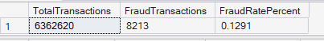
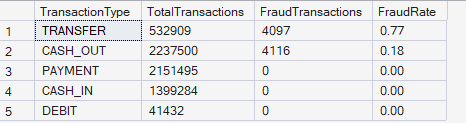
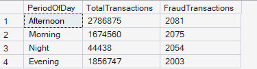
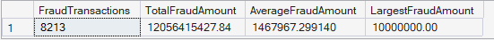
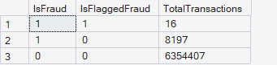
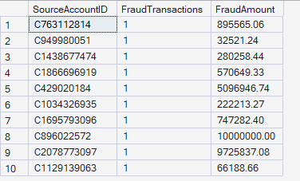
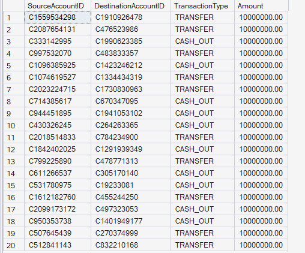
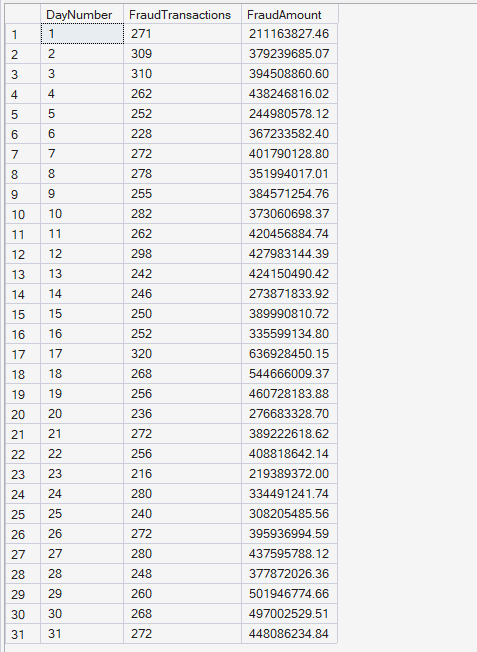
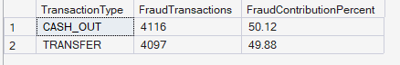

  # 🚨 Fraud Analytics Results

  
  

 

## 📖 Overview

This document presents the results of the Fraud Analytics module developed for the Enterprise FinTech Payment Intelligence Platform.

The analysis focuses on fraud detection, fraud concentration, transaction risk, fraud patterns, financial impact, and fraud monitoring across the payment ecosystem.

---

## 📉 KPI 1: Overall Fraud Rate

**🎯 Business Objective:** Calculate the overall fraud rate across all processed transactions.

**📈 SQL Output:**  

**🧠 Business Interpretation:** Out of 6,362,620 processed transactions, only 8,213 were fraudulent, resulting in an overall fraud rate of approximately **0.1291%**.

**💡 Key Insight:** Fraud represents a very small percentage of total platform activity but can still lead to significant financial losses due to high transaction values.

**✅ Business Recommendation:** Implement continuous fraud monitoring using real-time anomaly detection models to minimize financial losses while maintaining customer experience.

---

## 🥧 KPI 2: Fraud by Transaction Type

**🎯 Business Objective:** Measure fraud concentration across different transaction types.

**📈 SQL Output:**  

**🧠 Business Interpretation:** Fraud occurs exclusively within **TRANSFER** and **CASH_OUT** transactions, while PAYMENT, CASH_IN, and DEBIT transactions recorded no fraud cases.

**💡 Key Insight:** Fraud is concentrated within high-risk transaction channels rather than being evenly distributed across all payment types.

**✅ Business Recommendation:** Apply stricter fraud detection rules and transaction monitoring specifically for TRANSFER and CASH_OUT operations.

---

## 🕒 KPI 3: Fraud by Period of Day

**🎯 Business Objective:** Identify when fraudulent transactions occur throughout the day.

**📈 SQL Output:**  

**🧠 Business Interpretation:** Fraudulent transactions are relatively evenly distributed across Morning, Afternoon, Evening, and Night, with only slight variations between periods.

**💡 Key Insight:** Fraudsters operate throughout the day rather than targeting a single time window.

**✅ Business Recommendation:** Maintain consistent fraud monitoring across all operating hours instead of focusing only on specific periods.

---

## 💰 KPI 4: Fraud Amount Analysis

**🎯 Business Objective:** Measure the financial impact of fraudulent transactions.

**📈 SQL Output:**  

**🧠 Business Interpretation:** Fraudulent transactions account for more than **12 billion** in total fraud value, with an average fraudulent transaction exceeding **1.46 million** and the largest fraud reaching **10 million**.

**💡 Key Insight:** Although fraud frequency is low, each fraudulent transaction carries substantial financial risk.

**✅ Business Recommendation:** Introduce additional verification procedures for high-value transactions before processing.

---

## 🚩 KPI 5: Flagged vs Actual Fraud

**🎯 Business Objective:** Compare system-generated fraud flags with actual fraudulent transactions.

**📈 SQL Output:**  

**🧠 Business Interpretation:** Only **16** fraudulent transactions were successfully flagged by the system, while **8,197** fraud cases remained unflagged.

**💡 Key Insight:** The existing fraud detection mechanism demonstrates very low detection coverage.

**✅ Business Recommendation:** Improve fraud detection models using machine learning, behavioral analytics, and rule-based risk scoring.

---

## 🕵️ KPI 6: Top Fraudulent Source Accounts

**🎯 Business Objective:** Identify source accounts responsible for fraudulent transactions.

**📈 SQL Output:**  

**🧠 Business Interpretation:** Each listed source account is associated with one fraudulent transaction, although the fraud amounts vary significantly between accounts.

**💡 Key Insight:** Fraud is distributed across multiple customer accounts rather than concentrated within a small number of repeat offenders.

**✅ Business Recommendation:** Implement account-level risk scoring to identify suspicious behavior before additional fraudulent transactions occur.

---

## 🐳 KPI 7: Largest Fraudulent Transactions

**🎯 Business Objective:** Identify the highest-value fraudulent transactions processed by the platform.

**📈 SQL Output:**  

**🧠 Business Interpretation:** The largest fraudulent transactions each involve amounts of **10,000,000**, primarily within TRANSFER and CASH_OUT transaction types.

**💡 Key Insight:** Large-value transactions represent the highest financial exposure for the payment platform.

**✅ Business Recommendation:** Require enhanced authentication and additional approval workflows for exceptionally large transactions.

---

## 📅 KPI 8: Fraud Trend by Simulation Day

**🎯 Business Objective:** Track fraudulent transaction activity across simulation days.

**📈 SQL Output:**  

**🧠 Business Interpretation:** Fraud cases occur throughout the entire simulation period with moderate daily fluctuations rather than isolated spikes.

**💡 Key Insight:** Fraud remains a continuous operational risk requiring ongoing monitoring.

**✅ Business Recommendation:** Develop real-time fraud dashboards to monitor daily fraud trends and rapidly detect abnormal increases.

---

## 📊 KPI 9: Fraud Contribution by Transaction Type

**🎯 Business Objective:** Measure each transaction type's contribution to total fraud.

**📈 SQL Output:**  

**🧠 Business Interpretation:** CASH_OUT contributes **50.12%** of all fraud cases, while TRANSFER contributes **49.88%**, indicating an almost equal distribution between these two transaction types.

**💡 Key Insight:** Fraud risk is almost entirely concentrated within CASH_OUT and TRANSFER operations.

**✅ Business Recommendation:** Prioritize fraud prevention resources toward these transaction types by implementing stronger transaction validation, behavioral analysis, and real-time monitoring.

---

## 📝 Module Summary

The Fraud Analytics module provides comprehensive visibility into fraud occurrence, fraud concentration, transaction risk, financial impact, fraud trends, and fraud detection effectiveness. These insights support proactive fraud prevention, operational risk management, regulatory compliance, and strategic decision-making for enterprise-scale digital payment platforms.