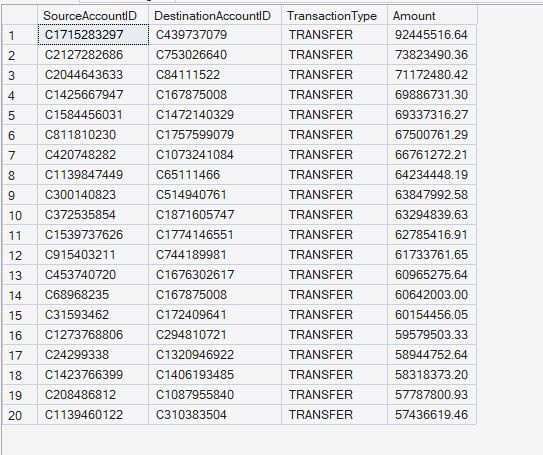
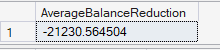
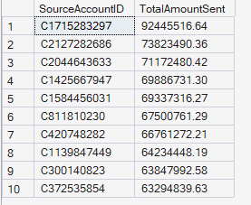
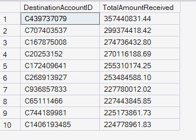
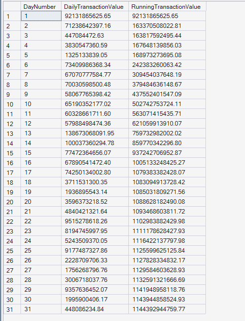
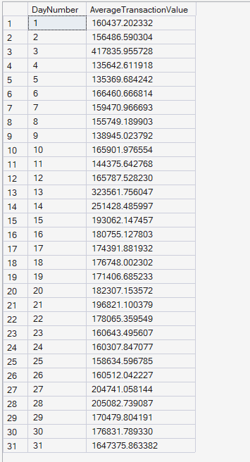
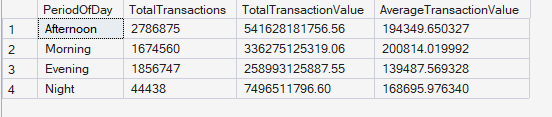
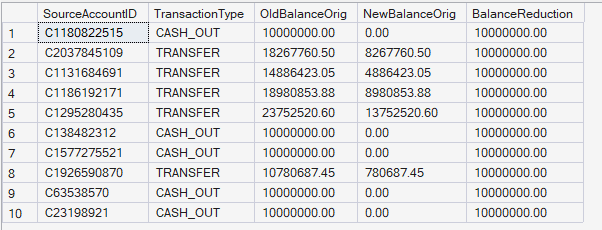
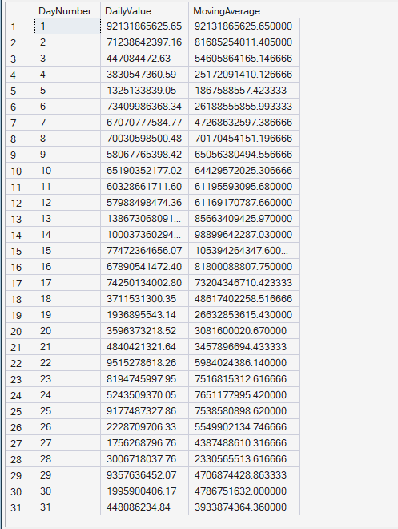

  # 💸 Money Flow Analytics Results

  
  

 

## 📖 Overview

This document presents the results of the Money Flow Analytics module developed for the Enterprise FinTech Payment Intelligence Platform.

The analysis focuses on understanding how money moves throughout the payment ecosystem by examining transaction values, sender-receiver relationships, balance changes, cumulative transaction growth, and payment trends over time.

---

## 🚀 KPI 1: Largest Transactions

**🎯 Business Objective:** Identify the highest-value transactions processed by the payment platform.

**📈 SQL Output:**  

**🧠 Business Interpretation:** The largest transactions exceed **9 million**, with the highest transaction reaching approximately **9.24 million**. Most of these transactions belong to the **TRANSFER** transaction type.

**💡 Key Insight:** A relatively small number of transactions contribute significantly to the platform's overall payment value.

**✅ Business Recommendation:** Implement additional verification and risk controls for exceptionally large transactions before authorization.

---

## 📉 KPI 2: Average Balance Movement

**🎯 Business Objective:** Measure the average balance reduction across all source accounts.

**📈 SQL Output:**  

**🧠 Business Interpretation:** The average balance reduction is approximately **-21,230**, indicating that, on average, account balances decrease after payment processing.

**💡 Key Insight:** Balance movement provides valuable insight into customer spending behavior and cash flow patterns.

**✅ Business Recommendation:** Monitor unusual balance reductions that significantly deviate from normal customer behavior to identify potential fraud or abnormal activity.

---

## 📤 KPI 3: Total Money Sent by Source Account

**🎯 Business Objective:** Identify the source accounts transferring the highest monetary value.

**📈 SQL Output:**  

**🧠 Business Interpretation:** The leading source account transferred more than **92 million**, with several other accounts also processing substantial payment volumes.

**💡 Key Insight:** A relatively small number of accounts contribute disproportionately to the overall outgoing transaction value.

**✅ Business Recommendation:** Implement enhanced monitoring and relationship management for high-value customers while continuously evaluating transaction risk.

---

## 📥 KPI 4: Total Money Received by Destination Account

**🎯 Business Objective:** Identify destination accounts receiving the largest payment values.

**📈 SQL Output:**  

**🧠 Business Interpretation:** The highest-value destination account received over **357 million**, demonstrating that payment inflows are concentrated among a limited number of receiving accounts.

**💡 Key Insight:** Certain destination accounts play a critical role within the payment ecosystem by processing exceptionally large monetary inflows.

**✅ Business Recommendation:** Continuously monitor high-value receiving accounts to support fraud prevention, compliance, and operational stability.

---

## 📈 KPI 5: Running Transaction Value

**🎯 Business Objective:** Measure cumulative transaction value across the simulation period.

**📈 SQL Output:**  

**🧠 Business Interpretation:** The cumulative transaction value increases consistently throughout the simulation, reflecting continuous payment activity across all simulation days.

**💡 Key Insight:** The payment platform demonstrates sustained transaction growth without significant interruptions.

**✅ Business Recommendation:** Track cumulative transaction value through executive dashboards to monitor business growth and identify unexpected changes in payment volume.

---

## 📊 KPI 6: Daily Average Transaction Value

**🎯 Business Objective:** Measure the average transaction value for each simulation day.

**📈 SQL Output:**  

**🧠 Business Interpretation:** Average transaction values fluctuate moderately across simulation days, indicating changing customer payment behavior over time.

**💡 Key Insight:** Daily transaction values remain relatively stable while exhibiting normal operational variation.

**✅ Business Recommendation:** Monitor significant deviations from historical averages to identify unusual transaction behavior or operational anomalies.

---

## 🕒 KPI 7: Transaction Value by Period of Day

**🎯 Business Objective:** Compare transaction activity across different periods of the day.

**📈 SQL Output:**  

**🧠 Business Interpretation:** The **Afternoon** period records both the highest transaction volume and the highest transaction value, while **Night** processes the lowest activity.

**💡 Key Insight:** Transaction behavior varies considerably throughout the day, with customer activity concentrated during business hours.

**✅ Business Recommendation:** Allocate payment infrastructure and fraud monitoring resources according to peak transaction periods to improve operational efficiency.

---

## 💰 KPI 8: Largest Balance Reductions

**🎯 Business Objective:** Identify transactions causing the largest reductions in source account balances.

**📈 SQL Output:**  

**🧠 Business Interpretation:** Several transactions reduce customer balances by **10 million**, representing the largest balance decreases observed within the dataset.

**💡 Key Insight:** Large balance reductions correspond to high-value transactions that may require additional monitoring.

**✅ Business Recommendation:** Apply enhanced authentication and risk validation for transactions producing exceptionally large balance changes.

---

## 📉 KPI 9: 3-Day Moving Average Transaction Value

**🎯 Business Objective:** Smooth daily transaction trends using a three-day moving average.

**📈 SQL Output:**  

**🧠 Business Interpretation:** The moving average reduces short-term fluctuations and provides a clearer view of underlying payment trends throughout the simulation.

**💡 Key Insight:** Moving averages provide a more stable representation of transaction growth than daily values alone.

**✅ Business Recommendation:** Incorporate moving-average metrics into executive dashboards to support trend analysis, forecasting, and operational planning.

---

## 📝 Module Summary

The Money Flow Analytics module provides comprehensive visibility into how funds move across the payment platform by analyzing transaction values, account-level money movement, balance changes, cumulative payment growth, and temporal transaction patterns. These insights enable financial monitoring, operational optimization, fraud prevention, customer behavior analysis, and strategic decision-making for enterprise-scale digital payment platforms.