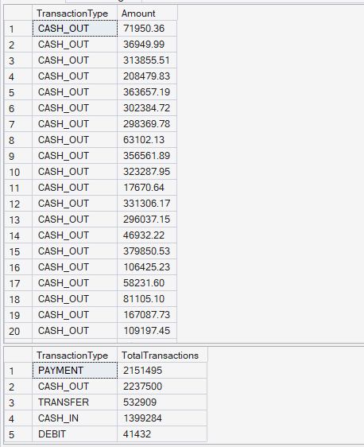
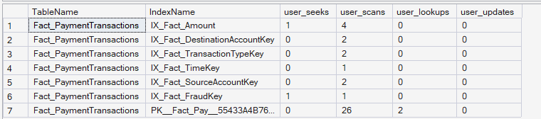
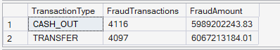
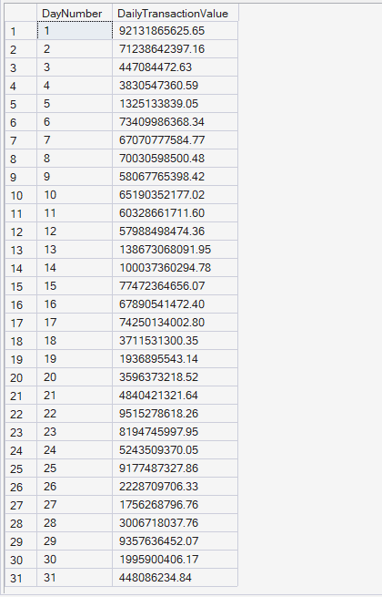
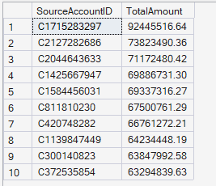
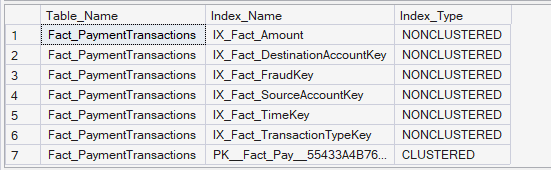

# Query Optimization Results

## Overview

This document presents the results of the Query Optimization module developed for the Enterprise FinTech Payment Intelligence Platform.

The objective of this module is to evaluate SQL Server query performance, verify index utilization, analyze execution efficiency, and demonstrate how indexing improves analytical query execution within an enterprise-scale payment warehouse.

---

# KPI 1: Indexed Foreign Key Query Performance

## Business Objective

Retrieve CASH_OUT transactions using an indexed foreign key and demonstrate efficient query execution.

## SQL Output

**Result:** The query returned **2,237,500 CASH_OUT transactions**.

Due to the large result set, the screenshot below displays only a representative sample (first 20 rows) of the complete query output.

The screenshot also includes the transaction type aggregation query executed while viewing the actual execution plan.

## Business Interpretation

The indexed query efficiently retrieves CASH_OUT transactions from millions of payment records, demonstrating the benefit of indexing foreign key columns for high-volume transactional systems.

## Key Insight

Proper indexing significantly improves query performance when filtering frequently accessed transaction types.

## Business Recommendation

Create and maintain indexes on frequently filtered columns to reduce query execution time and improve reporting performance.

---

# KPI 2: Verify Index Usage

## Business Objective

Evaluate how SQL Server utilizes indexes created on the Fact_PaymentTransactions table.

## SQL Output

## Business Interpretation

The index usage statistics show that SQL Server actively utilizes several nonclustered indexes while executing analytical queries, confirming that the indexing strategy supports efficient data retrieval.

## Key Insight

Appropriate index selection minimizes unnecessary table scans and improves query efficiency.

## Business Recommendation

Regularly monitor index usage statistics and remove unused indexes while maintaining those supporting frequently executed analytical queries.

---

# KPI 3: Fraud Query Performance

## Business Objective

Evaluate the performance of analytical queries involving multiple indexed joins for fraud detection.

## SQL Output

## Business Interpretation

The fraud analysis query efficiently aggregates fraudulent transactions across transaction types while joining multiple dimension tables.

## Key Insight

Well-designed star schemas combined with indexed foreign keys enable high-performance analytical queries.

## Business Recommendation

Continue optimizing fraud reporting queries using indexed dimensions and regularly review execution plans for performance improvements.

---

# KPI 4: Time-Series Performance

## Business Objective

Measure aggregation performance across the Time dimension.

## SQL Output

## Business Interpretation

Daily transaction values are aggregated efficiently across all simulation days, demonstrating strong performance for time-series reporting.

## Key Insight

The Time dimension supports efficient aggregation and trend analysis across large transaction datasets.

## Business Recommendation

Utilize indexed date dimensions for executive dashboards, trend analysis, forecasting, and operational reporting.

---

# KPI 5: Top Source Accounts Performance

## Business Objective

Evaluate query performance when grouping high-cardinality account data.

## SQL Output

## Business Interpretation

The query efficiently identifies the highest-value customer accounts despite processing millions of payment records.

## Key Insight

SQL Server performs grouping and aggregation efficiently when supported by appropriate indexing and warehouse design.

## Business Recommendation

Maintain optimized indexing strategies for customer-level analytical queries to ensure consistent reporting performance.

---

# KPI 6: Optimization Summary

## Business Objective

Review the final index architecture supporting the analytical warehouse.

## SQL Output

## Business Interpretation

The Fact_PaymentTransactions table utilizes a clustered primary key together with multiple nonclustered indexes supporting transaction type, time, fraud, source account, destination account, and amount-based analytical queries.

## Key Insight

A well-designed indexing strategy significantly improves warehouse query performance while supporting enterprise-scale reporting workloads.

## Business Recommendation

Perform periodic index maintenance, monitor fragmentation, and review execution plans to ensure optimal long-term SQL Server performance.

---

## Module Summary

The Query Optimization module demonstrates how SQL Server indexing, execution plans, and performance monitoring improve analytical query execution within an enterprise payment warehouse. By validating index usage and evaluating query efficiency across multiple business scenarios, this module highlights the importance of database optimization for scalable reporting, fraud analysis, operational analytics, and enterprise decision support.