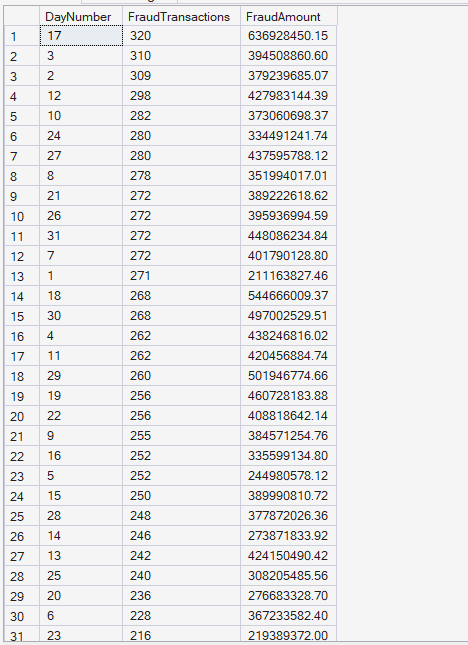
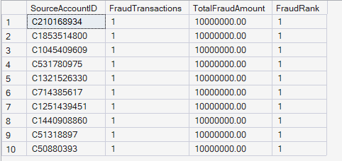
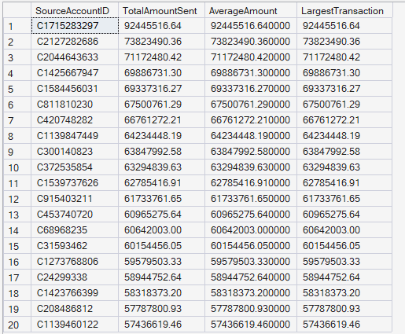
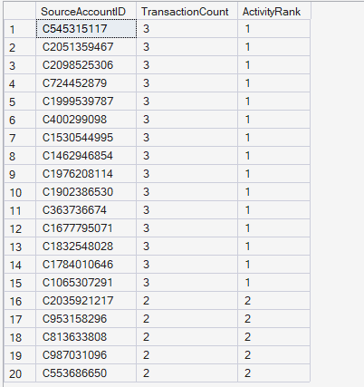
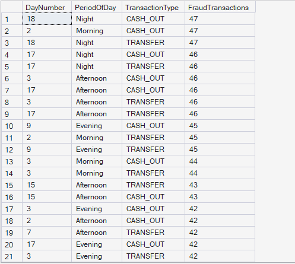
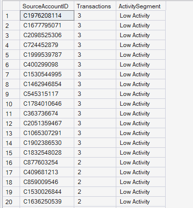
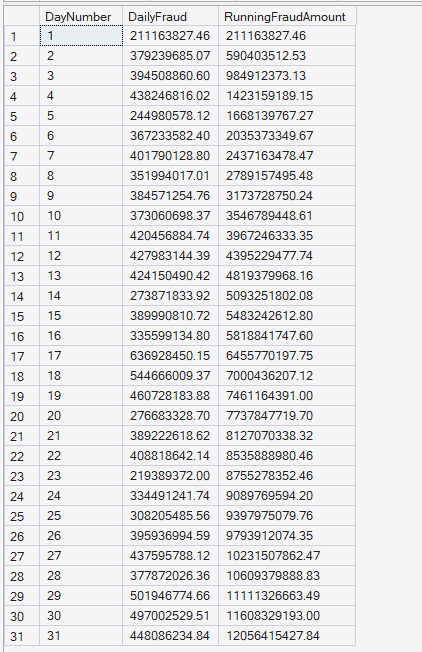
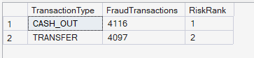

  # 💼 SQL Business Case Studies Results
  ## Enterprise FinTech Payment Intelligence Platform

  
  
  
  

 

# 📖 Overview

This document presents the results of the SQL Business Case Studies module developed for the Enterprise FinTech Payment Intelligence Platform.

The case studies simulate real-world FinTech business scenarios using advanced SQL techniques, including fraud investigation, customer behavior analysis, transaction monitoring, ranking, segmentation, Common Table Expressions (CTEs), and Window Functions.

---

## 🔍 Case Study 1: Fraud Spike Investigation

**🎯 Business Problem:** Identify the simulation day with the highest number of fraudulent transactions.

**📈 SQL Output:**

**🧠 Business Interpretation:** Day **17** recorded the highest number of fraudulent transactions (**320**) with fraud losses exceeding **63.69 million**, making it the highest fraud spike observed in the simulation period.

**💡 Key Insight:** Fraud activity is not evenly distributed across time. Certain simulation days experience significantly higher fraud concentration.

**✅ Business Recommendation:** Implement daily fraud monitoring dashboards and automated anomaly detection to identify sudden fraud spikes as early as possible.

---

## 🕵️ Case Study 2: Top Fraud Contributors

**🎯 Business Problem:** Identify source accounts responsible for the highest fraud amounts.

**📈 SQL Output:**

**🧠 Business Interpretation:** Several source accounts generated fraudulent transactions of **10 million** each, resulting in identical fraud rankings.

**💡 Key Insight:** Large-value fraud attempts originate from multiple independent accounts rather than a single dominant fraudster.

**✅ Business Recommendation:** Implement enhanced verification and behavioral monitoring for accounts performing unusually large transactions.

---

## ⚠️ Case Study 3: High-Value Account Analysis

**🎯 Business Problem:** Identify accounts sending unusually large transaction values.

**📈 SQL Output:**

**🧠 Business Interpretation:** The highest-value account transferred over **92.45 million**, with several others exceeding **60 million**, indicating significant differences in customer payment behavior.

**💡 Key Insight:** A relatively small group of customers contributes a disproportionately large share of total transaction value.

**✅ Business Recommendation:** Classify these accounts as high-value customers and continuously monitor their activity for fraud, compliance, and risk management.

---

## ⚡ Case Study 4: Transaction Velocity Analysis

**🎯 Business Problem:** Identify highly active customer accounts based on transaction frequency.

**📈 SQL Output:**

**🧠 Business Interpretation:** Multiple source accounts share the highest activity level with **three transactions**, resulting in equal activity rankings.

**💡 Key Insight:** Customer transaction activity is broadly distributed, with no single account dominating transaction frequency.

**✅ Business Recommendation:** Use transaction velocity as an important behavioral feature in fraud detection and customer segmentation models.

---

## 📍 Case Study 5: Fraud Hotspot Detection

**🎯 Business Problem:** Identify combinations of simulation day, period of day, and transaction type with the highest fraud concentration.

**📈 SQL Output:**

**Result:** This query returned **248 records**, representing combinations of simulation day, period of day, and transaction type.

> *Due to the large result set, the screenshot below displays only a representative sample (first 20–30 rows) of the complete query output.*

**🧠 Business Interpretation:** Fraud incidents are concentrated during specific periods of the day, particularly involving **TRANSFER** and **CASH_OUT** transactions.

**💡 Key Insight:** Fraud hotspots occur only under particular combinations of transaction type and time period rather than being randomly distributed.

**✅ Business Recommendation:** Deploy dynamic fraud detection rules that consider transaction type, time of day, and historical fraud hotspots simultaneously.

---

## 👥 Case Study 6: Customer Activity Segmentation

**🎯 Business Problem:** Segment customer accounts according to transaction frequency.

**📈 SQL Output:**

**Result:** This query returned **6,353,307 records** (one row per source account).

> *Due to the large result set, the screenshot below displays only a representative sample (first 20 rows) of the complete query output.*

**🧠 Business Interpretation:** Most customer accounts fall into the **Low Activity** category because they perform only a small number of transactions.

**💡 Key Insight:** The payment platform serves a very broad customer base where transaction activity is widely distributed.

**✅ Business Recommendation:** Use activity segmentation to personalize customer engagement strategies and identify low-, medium-, and high-activity customers.

---

## 📈 Case Study 7: Running Fraud Amount

**🎯 Business Problem:** Monitor cumulative fraud losses throughout the simulation period.

**📈 SQL Output:**

**🧠 Business Interpretation:** The cumulative fraud amount steadily increases throughout the simulation period, reaching approximately **12.06 billion** by the final day.

**💡 Key Insight:** Fraud losses accumulate continuously over time, emphasizing the financial impact of delayed fraud detection.

**✅ Business Recommendation:** Implement real-time fraud detection and early intervention mechanisms to reduce cumulative financial losses.

---

## 📊 Case Study 8: Transaction Type Risk Ranking

**🎯 Business Problem:** Rank transaction types according to fraud occurrence.

**📈 SQL Output:**

**🧠 Business Interpretation:** **CASH_OUT** transactions rank first with **4,116** fraud cases, followed closely by **TRANSFER** transactions with **4,097** fraud cases.

**💡 Key Insight:** Nearly all fraud activity occurs within only two transaction types.

**✅ Business Recommendation:** Allocate fraud prevention resources primarily toward CASH_OUT and TRANSFER transactions to maximize fraud detection effectiveness.

---

## 📝 Module Summary

The SQL Business Case Studies module demonstrates practical business problem-solving using advanced SQL techniques such as CTEs, Window Functions, Ranking Functions, Running Totals, and customer segmentation.

The analyses provide valuable insights into fraud investigation, customer behavior, transaction monitoring, operational risk management, and strategic decision-making for enterprise-scale digital payment platforms.