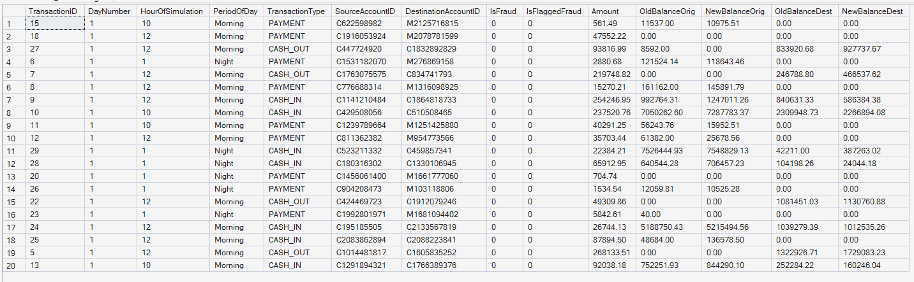
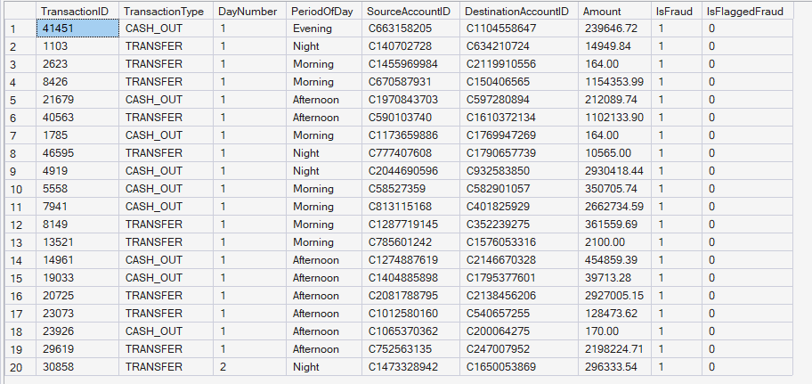
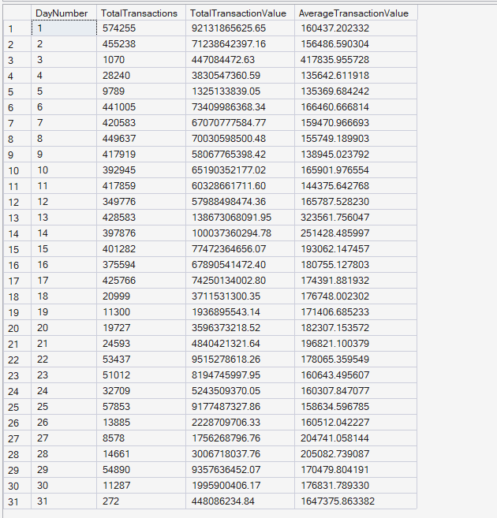
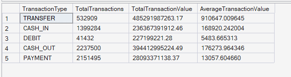

  # 👁️ SQL Views Results

  
  

 

## 📖 Overview

This document presents the results of the SQL Views module developed for the Enterprise FinTech Payment Intelligence Platform.

The module demonstrates the creation of reusable SQL Server views that simplify analytical reporting by combining data from multiple warehouse tables into business-friendly datasets. These views improve query reusability, reporting consistency, and support enterprise-scale payment analytics.

---

## 📊 View 1: Payment Summary

**🎯 Business Objective:** Create a reusable consolidated view containing transaction, account, time, and fraud information for enterprise reporting.

**📈 SQL Output:**  

**🧠 Business Interpretation:** The view combines transaction facts with multiple dimension tables, providing a unified dataset containing transaction details, account information, payment type, fraud indicators, and simulation time attributes.

**💡 Key Insight:** A single reusable business view eliminates the need for repeatedly joining multiple warehouse tables, improving reporting efficiency and consistency.

**✅ Business Recommendation:** Use this view as the primary reporting dataset for dashboards, business intelligence tools, and operational analytics.

---

## 🚨 View 2: Fraud Summary

**🎯 Business Objective:** Create a reusable dataset containing only fraudulent transactions.

**📈 SQL Output:**  

**🧠 Business Interpretation:** The view filters only confirmed fraudulent transactions while retaining transaction details, account information, payment type, and fraud indicators for investigation.

**💡 Key Insight:** Separating fraudulent transactions into a dedicated view simplifies fraud monitoring and investigative reporting.

**✅ Business Recommendation:** Use this view for fraud dashboards, compliance reporting, and risk investigation workflows.

---

## 📅 View 3: Daily Transaction Summary

**🎯 Business Objective:** Create a reusable daily summary of platform transaction activity.

**📈 SQL Output:**  

**🧠 Business Interpretation:** The view aggregates transaction volume, total payment value, and average transaction value for each simulation day, providing a concise overview of daily platform performance.

**💡 Key Insight:** Daily aggregation enables rapid identification of transaction spikes, seasonal behavior, and operational trends.

**✅ Business Recommendation:** Leverage this view for executive dashboards, operational monitoring, and trend analysis.

---

## 🥧 View 4: Transaction Type Summary

**🎯 Business Objective:** Summarize transaction activity across different payment mechanisms.

**📈 SQL Output:**  

**🧠 Business Interpretation:** The view aggregates transaction count, total transaction value, and average transaction value for each transaction type, providing insights into payment channel utilization.

**💡 Key Insight:** Different transaction types contribute varying levels of transaction volume and monetary value, helping understand customer payment preferences.

**✅ Business Recommendation:** Use this view to monitor payment channel performance, optimize payment infrastructure, and support strategic business decisions.

---

## 📝 Module Summary

The SQL Views module establishes reusable business-friendly datasets that simplify enterprise reporting by encapsulating complex joins and aggregations into standardized database objects. These views provide a consistent foundation for dashboards, analytical queries, fraud monitoring, and operational reporting while improving maintainability and query reusability across the Enterprise FinTech Payment Intelligence Platform.