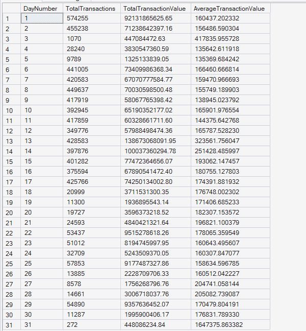
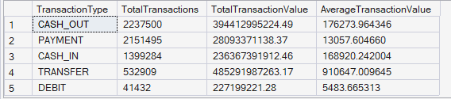
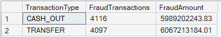
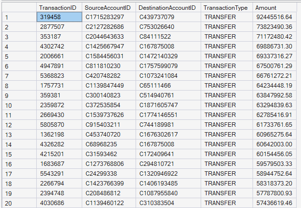
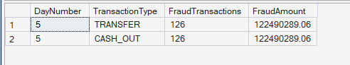

  # ⚙️ Stored Procedures Results

  
  

 

## 📖 Overview

This document presents the results of the Stored Procedures module developed for the Enterprise FinTech Payment Intelligence Platform.

The module demonstrates reusable SQL Server stored procedures that encapsulate business logic for payment analytics, fraud monitoring, and high-value transaction reporting. These procedures improve maintainability, code reusability, and operational reporting within enterprise-scale payment systems.

---

## 📅 Stored Procedure 1: Daily Transaction Summary

**🎯 Business Objective:** Retrieve a daily summary of transaction volume and payment value.

**📈 SQL Output:**  

**🧠 Business Interpretation:** The procedure aggregates transaction count, total transaction value, and average transaction value for every simulation day, providing a comprehensive daily operational summary.

**💡 Key Insight:** Daily transaction activity varies significantly across the simulation period, indicating changing customer payment behavior and transaction workloads.

**✅ Business Recommendation:** Use this procedure to power executive dashboards, operational reporting, and daily transaction monitoring.

---

## 🥧 Stored Procedure 2: Transaction Type Summary

**🎯 Business Objective:** Summarize transaction activity across different payment mechanisms.

**📈 SQL Output:**  

**🧠 Business Interpretation:** The procedure summarizes transaction count, total payment value, and average transaction value for each transaction type, enabling comparison across payment channels.

**💡 Key Insight:** Different payment mechanisms contribute varying transaction volumes and monetary values, highlighting differences in customer payment preferences.

**✅ Business Recommendation:** Leverage these insights to optimize payment infrastructure and monitor transaction channel performance.

---

## 🚨 Stored Procedure 3: Fraud Summary

**🎯 Business Objective:** Summarize fraudulent transaction activity by payment type.

**📈 SQL Output:**  

**🧠 Business Interpretation:** The procedure aggregates confirmed fraudulent transactions and their corresponding monetary value for each transaction type.

**💡 Key Insight:** Fraud activity is concentrated within CASH_OUT and TRANSFER transactions, making them the highest-risk payment mechanisms.

**✅ Business Recommendation:** Prioritize fraud detection models and risk controls for high-risk transaction categories.

---

## 💎 Stored Procedure 4: High Value Transactions

**🎯 Business Objective:** Retrieve all transactions exceeding a configurable monetary threshold.

**📈 SQL Output:**  
**Result:** This procedure returned **130,626 records** for transactions greater than or equal to **1,000,000**.

Due to the large result set, the screenshot below displays only a representative sample (first 20 rows) of the complete procedure output.

**🧠 Business Interpretation:** The procedure identifies exceptionally large transactions that may require additional monitoring, compliance validation, or fraud investigation.

**💡 Key Insight:** A substantial number of high-value transactions exist within the payment platform, emphasizing the importance of continuous monitoring for large financial movements.

**✅ Business Recommendation:** Implement automated alerts and enhanced verification procedures for transactions exceeding predefined monetary thresholds.

---

## 🕵️ Stored Procedure 5: Fraud by Day

**🎯 Business Objective:** Analyze fraudulent transaction activity for a specific simulation day.

**📈 SQL Output:**  

**🧠 Business Interpretation:** For Day 5, both TRANSFER and CASH_OUT transactions contributed equally to fraudulent activity, with identical fraud counts and fraud amounts.

**💡 Key Insight:** Fraud patterns may involve multiple transaction types simultaneously, requiring comprehensive fraud monitoring rather than focusing on a single payment channel.

**✅ Business Recommendation:** Perform periodic day-level fraud analysis to identify abnormal spikes and support proactive fraud prevention strategies.

---

## 📝 Module Summary

The Stored Procedures module demonstrates enterprise-grade reusable SQL components for payment analytics, fraud monitoring, and operational reporting. By encapsulating analytical logic into parameterized procedures, the platform improves maintainability, reporting consistency, operational efficiency, and supports scalable enterprise payment analytics.