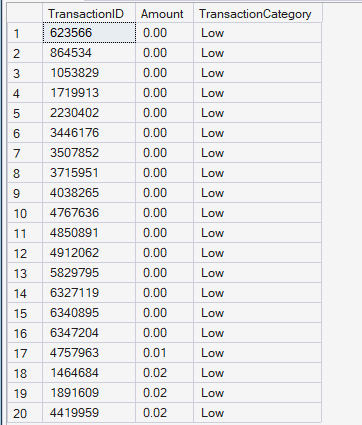
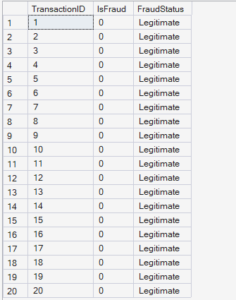
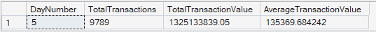
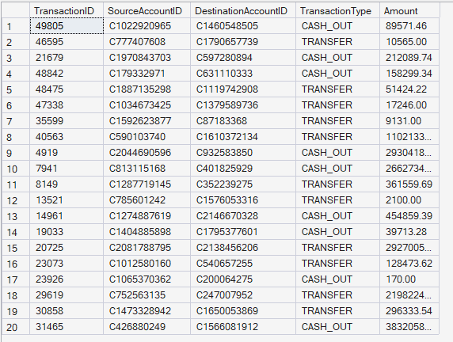
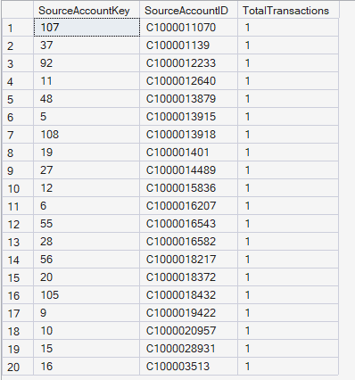

  # 🧩 User Defined Functions Results

  
  

 

## 📖 Overview

This document presents the results of the User Defined Functions (UDFs) module developed for the Enterprise FinTech Payment Intelligence Platform.

The module demonstrates both scalar and inline table-valued functions that encapsulate reusable business logic for transaction classification, fraud interpretation, daily analytics, fraud retrieval, and account-level activity measurement.

---

## 🏷️ Function 1: Transaction Category

**🎯 Business Objective:** Categorize transactions into Low, Medium, and High value groups based on transaction amount.

**📈 SQL Output:**  

**🧠 Business Interpretation:** The function classifies each transaction according to predefined monetary thresholds, enabling consistent transaction segmentation across analytical workloads.

**💡 Key Insight:** Low-value transactions dominate the initial sample, demonstrating the function's ability to standardize transaction categorization for downstream analytics.

**✅ Business Recommendation:** Use transaction categories within dashboards, fraud detection models, and customer segmentation strategies to simplify analytical reporting.

---

## 🚨 Function 2: Fraud Status

**🎯 Business Objective:** Convert binary fraud indicators into human-readable fraud status labels.

**📈 SQL Output:**  

**🧠 Business Interpretation:** The function translates binary fraud flags into descriptive business terminology such as "Fraud" and "Legitimate," making analytical outputs easier to interpret.

**💡 Key Insight:** Business-friendly labels improve reporting readability and reduce dependency on technical binary values.

**✅ Business Recommendation:** Use descriptive fraud status labels throughout operational dashboards and fraud investigation reports.

---

## 📅 Function 3: Daily Summary

**🎯 Business Objective:** Retrieve transaction statistics for a specific simulation day using a parameterized table-valued function.

**📈 SQL Output:**  

**🧠 Business Interpretation:** For Day 5, the function returns transaction count, total transaction value, and average transaction value, providing a concise operational summary for the selected day.

**💡 Key Insight:** Parameterized functions enable efficient retrieval of daily business metrics without rewriting aggregation queries.

**✅ Business Recommendation:** Use parameterized daily summaries to support operational reporting and day-level business performance analysis.

---

## 🕵️ Function 4: Fraud Transactions

**🎯 Business Objective:** Retrieve a reusable dataset containing only confirmed fraudulent transactions.

**📈 SQL Output:**  

**🧠 Business Interpretation:** The function returns detailed fraud records including source account, destination account, transaction type, and transaction amount, creating a reusable fraud investigation dataset.

**💡 Key Insight:** Centralizing fraud retrieval logic into a reusable function simplifies fraud analytics and improves code maintainability.

**✅ Business Recommendation:** Leverage this function within fraud dashboards, investigative workflows, and machine learning pipelines requiring fraud-specific datasets.

---

## 👥 Function 5: Source Account Transaction Count

**🎯 Business Objective:** Calculate the total number of transactions performed by a specific source account.

**📈 SQL Output:**  

**🧠 Business Interpretation:** The function returns transaction counts for individual source accounts, supporting customer activity measurement and account-level behavioral analysis.

**💡 Key Insight:** Reusable account-level transaction counts provide valuable inputs for customer segmentation and behavioral analytics.

**✅ Business Recommendation:** Use transaction frequency as an important feature for identifying active customers, dormant accounts, and potential anomalous behavior.

---

## 📝 Module Summary

The User Defined Functions module demonstrates reusable SQL Server programming techniques through scalar and inline table-valued functions. These functions improve code modularity, simplify analytical query development, promote business logic reuse, and support scalable enterprise payment analytics applications.