

  # 💻 Advanced SQL Demonstration Results

  
  

 

## 📖 Overview

This document presents the results of the Advanced SQL Demonstration module developed for the Enterprise FinTech Payment Intelligence Platform.

The module showcases advanced SQL Server programming techniques frequently used in enterprise analytics, including Window Functions, Common Table Expressions (CTEs), CASE expressions, EXISTS / NOT EXISTS, UNION ALL, CROSS APPLY, and the practical use of Views, User Defined Functions, and Stored Procedures.

---

## 🏆 Demo 1: Ranking Window Functions

**🎯 Business Objective:** Rank source accounts based on cumulative transaction value using multiple SQL window ranking functions.

**📈 SQL Output:**  
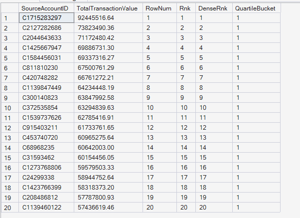

**🧠 Business Interpretation:** ROW_NUMBER(), RANK(), DENSE_RANK(), and NTILE() successfully rank source accounts according to total transaction value while also grouping accounts into quartiles.

**💡 Key Insight:** Window ranking functions provide flexible analytical ranking without collapsing detailed records, enabling comparative customer analysis.

**✅ Business Recommendation:** Use ranking functions for customer prioritization, VIP identification, and high-value account monitoring.

---

## 🔄 Demo 2: LAG & LEAD

**🎯 Business Objective:** Compare transaction volumes across consecutive simulation days.

**📈 SQL Output:**  
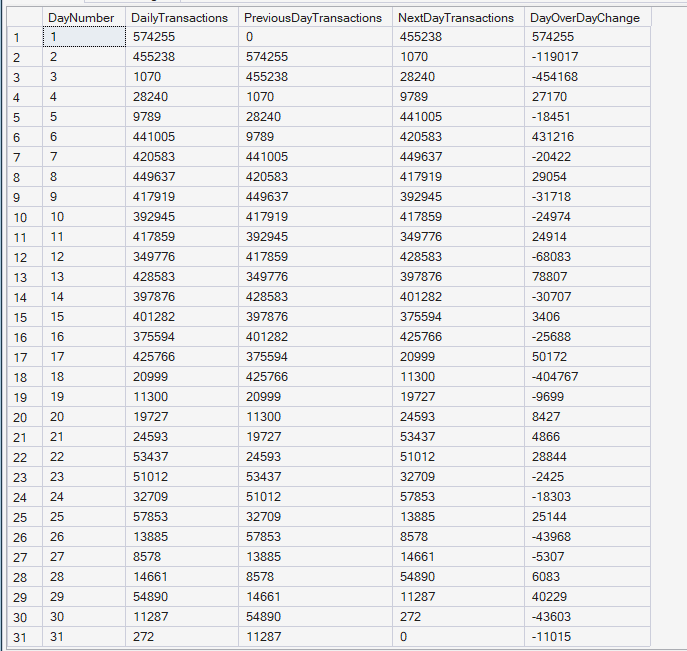

**🧠 Business Interpretation:** LAG() retrieves the previous day's transaction count while LEAD() retrieves the following day's transaction count, allowing day-over-day comparisons.

**💡 Key Insight:** Offset window functions simplify trend analysis without requiring self-joins.

**✅ Business Recommendation:** Monitor daily operational fluctuations to identify abnormal transaction spikes or declines.

---

## 📈 Demo 3: Running Totals & Moving Average

**🎯 Business Objective:** Calculate cumulative transaction value and smooth daily trends using moving averages.

**📈 SQL Output:**  
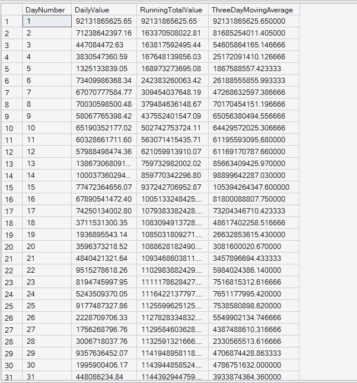

**🧠 Business Interpretation:** Running totals continuously accumulate transaction value across simulation days, while the three-day moving average smooths short-term fluctuations.

**💡 Key Insight:** Running totals reveal long-term growth, whereas moving averages highlight underlying trends by reducing daily volatility.

**✅ Business Recommendation:** Use cumulative metrics and moving averages for executive dashboards and operational trend monitoring.

---

## 🧬 Demo 4: Multiple Common Table Expressions (CTEs)

**🎯 Business Objective:** Identify high-value accounts that also have confirmed fraudulent activity.

**📈 SQL Output:**  
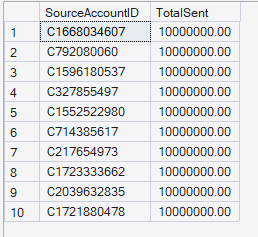

**🧠 Business Interpretation:** Multiple CTEs simplify complex business logic by separating high-value accounts and fraudulent accounts before combining them into a single analytical result.

**💡 Key Insight:** CTEs improve readability and maintainability for complex enterprise SQL queries.

**✅ Business Recommendation:** Use layered CTEs when implementing advanced fraud detection and customer risk analysis workflows.

---

## 🔀 Demo 5: CASE Expressions

**🎯 Business Objective:** Classify transactions into dynamic business risk categories.

**📈 SQL Output:**  
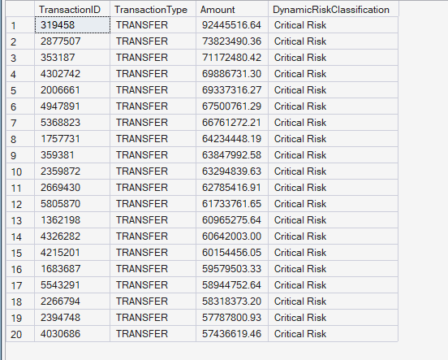

**🧠 Business Interpretation:** CASE expressions assign business risk levels according to transaction amount and transaction type.

**💡 Key Insight:** Dynamic business rules can be embedded directly into SQL queries without requiring external application logic.

**✅ Business Recommendation:** Implement rule-based transaction classification to support fraud monitoring and operational decision-making.

---

## 🔍 Demo 6: EXISTS / NOT EXISTS

**🎯 Business Objective:** Identify source accounts that have performed TRANSFER transactions but never executed CASH_OUT transactions.

**📈 SQL Output:**  
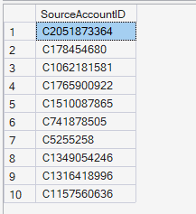

**🧠 Business Interpretation:** The EXISTS and NOT EXISTS operators efficiently identify accounts satisfying both inclusion and exclusion conditions.

**💡 Key Insight:** EXISTS-based filtering is highly effective for behavioral segmentation and anomaly detection.

**✅ Business Recommendation:** Use EXISTS logic for identifying specialized customer behaviors and operational exceptions.

---

## ➕ Demo 7: UNION ALL

**🎯 Business Objective:** Combine top source accounts and top destination accounts into a single unified dataset.

**📈 SQL Output:**  
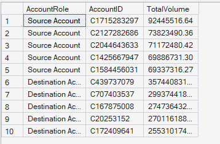

**🧠 Business Interpretation:** UNION ALL merges both account groups while preserving all records, providing a consolidated business view.

**💡 Key Insight:** UNION ALL efficiently combines related datasets without removing duplicates.

**✅ Business Recommendation:** Create unified executive reports by combining multiple business perspectives into a single result set.

---

## ⚡ Demo 8: CROSS APPLY

**🎯 Business Objective:** Retrieve the two largest transactions for each selected source account.

**📈 SQL Output:**  
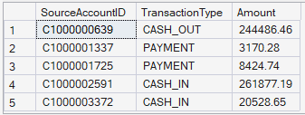

**🧠 Business Interpretation:** CROSS APPLY evaluates each source account individually and retrieves its highest-value transactions.

**💡 Key Insight:** CROSS APPLY enables efficient row-by-row analytical processing using correlated subqueries.

**✅ Business Recommendation:** Use CROSS APPLY when generating top-N analyses within grouped business entities.

---

## 👁️ Demo 9A: Querying Custom View

**🎯 Business Objective:** Retrieve data from a reusable fraud reporting view.

**📈 SQL Output:**  
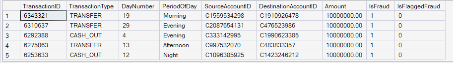

**🧠 Business Interpretation:** The reusable view provides a simplified fraud dataset containing transaction, account, and fraud information.

**💡 Key Insight:** Views simplify repeated analytical queries while improving code maintainability.

**✅ Business Recommendation:** Develop standardized reporting layers using SQL views to improve consistency across analytics teams.

---

## 🧩 Demo 9B: Using User Defined Function

**🎯 Business Objective:** Apply a reusable scalar function for transaction categorization.

**📈 SQL Output:**  
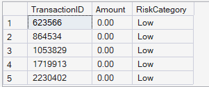

**🧠 Business Interpretation:** The scalar function consistently classifies transactions into predefined business categories.

**💡 Key Insight:** Reusable business logic within UDFs reduces duplicated code and standardizes analytics.

**✅ Business Recommendation:** Centralize reusable business rules using User Defined Functions wherever consistent classification is required.

---

## ⚙️ Demo 9C: Executing Stored Procedure

**🎯 Business Objective:** Retrieve high-value transactions using a parameterized stored procedure.

**📈 SQL Output:**  
**Result:** This stored procedure returned **11,515 records** for transactions greater than **5,000,000**.

Due to the large result set, the screenshot below displays only a representative sample (first 20 rows) of the complete output.

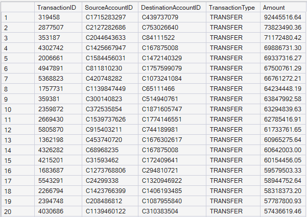

**🧠 Business Interpretation:** The stored procedure dynamically retrieves transactions exceeding the specified monetary threshold, returning only high-value payment activities. This enables analysts to focus on transactions that may require additional operational review or fraud investigation.

**💡 Key Insight:** Parameterized stored procedures provide flexible and reusable business reporting by allowing users to retrieve high-value transactions based on different threshold values without modifying the SQL code.

**✅ Business Recommendation:** Use parameterized stored procedures for operational monitoring, fraud investigations, compliance reporting, and executive dashboards that require dynamic filtering of high-value transactions.

---

## 📝 Module Summary

The Advanced SQL Demonstration module showcases enterprise-grade SQL Server capabilities through advanced programming constructs including Window Functions, CTEs, CASE expressions, EXISTS / NOT EXISTS, UNION ALL, CROSS APPLY, Views, User Defined Functions, and Stored Procedures. These techniques improve query performance, readability, maintainability, and scalability while supporting sophisticated payment analytics within enterprise financial systems.