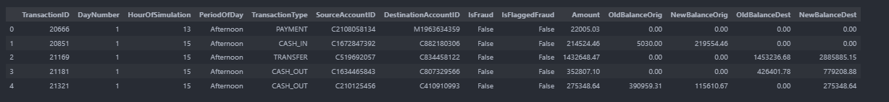
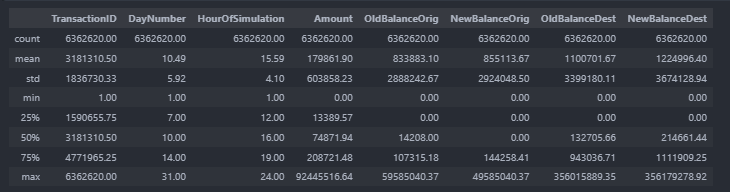
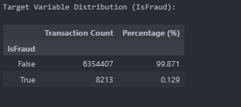

# Machine Learning Results

# Notebook 01: Data Preparation

## Overview

This notebook prepares the analytical dataset required for fraud prediction by extracting payment transaction data from the SQL Server Enterprise Data Warehouse. Data quality, completeness, and schema consistency are verified before exporting the dataset for subsequent machine learning stages.

---

# Step 1: SQL Server Data Extraction

## Business Objective

Load the enterprise payment dataset from the SQL Server semantic view into Python for machine learning.

## Output



## Business Interpretation

The analytical dataset was successfully extracted from SQL Server and loaded into a Pandas DataFrame. The dataset contains payment transactions along with fraud labels and customer balance information.

## Key Insight

The machine learning pipeline begins from the enterprise data warehouse rather than raw source files, ensuring consistency with the analytics platform.

---

# Step 2: Data Quality Verification

## Business Objective

Verify dataset completeness and structural consistency.

## Results

- Total Records: **6,362,620**
- Total Columns: **14**
- Missing Values: **0**
- Data Types Successfully Validated

## Business Interpretation

The dataset is complete with no missing values across any feature, making it suitable for downstream feature engineering and model development.

## Key Insight

High-quality input data minimizes preprocessing complexity and improves model reliability.

---

# Step 3: Statistical Summary

## Business Objective

Understand the numerical characteristics of transaction-related variables.

## Output



## Business Interpretation

Statistical profiling confirms that transaction amounts and account balances exhibit large numerical ranges and significant variation, suggesting that feature scaling will be beneficial during preprocessing.

## Key Insight

The presence of highly skewed financial variables indicates the need for normalization before model training.

---

# Step 4: Target Variable Analysis

## Business Objective

Analyze the fraud distribution within the dataset.

## Output



## Business Interpretation

The dataset contains **6,354,407 legitimate transactions** and **8,213 fraudulent transactions**, indicating an extreme class imbalance.

## Key Insight

Fraudulent transactions account for approximately **0.13%** of all observations, making class balancing techniques such as SMOTE essential before model training.

## Business Recommendation

Apply class imbalance handling techniques to improve fraud detection performance and reduce bias toward the majority class.

---

# Step 5: Dataset Export

## Business Objective

Export the validated analytical dataset for feature engineering.

## Results

Output Dataset:

```
clean_ml_dataset.csv
```

## Business Interpretation

The validated dataset was successfully exported and becomes the standardized input for the next phase of the machine learning pipeline.

---

# Notebook Summary

The Data Preparation notebook successfully extracted, validated, profiled, and exported the enterprise payment dataset. The analysis confirmed excellent data quality, no missing values, and a severe fraud class imbalance, establishing a reliable foundation for feature engineering and predictive modeling.