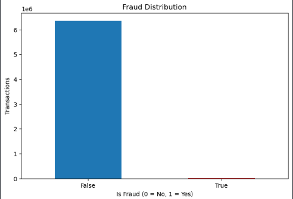
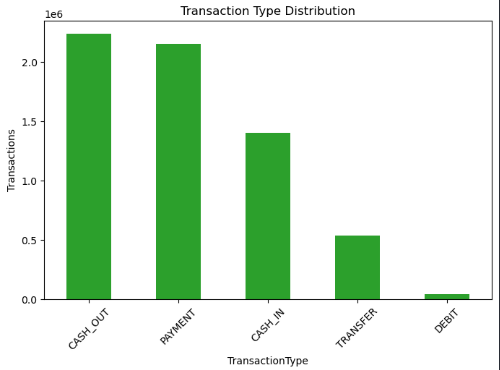
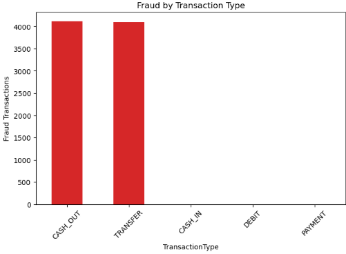
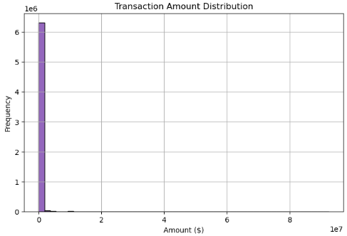
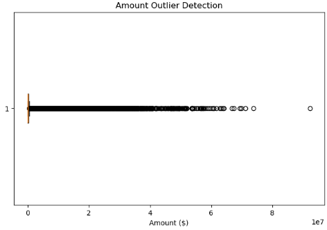
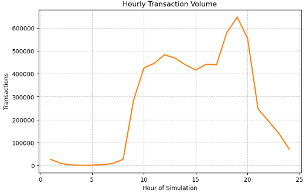

# Exploratory Data Analysis Results

## Overview

This notebook performs Exploratory Data Analysis (EDA) on the enterprise payment dataset to understand transaction behavior, fraud patterns, feature distributions, and operational trends before feature engineering and machine learning model development.

The analysis focuses on identifying class imbalance, transaction characteristics, fraud concentration, transaction amount distributions, outliers, and temporal transaction behavior.

---

# Step 1: Fraud Distribution Analysis

## Business Objective

Analyze the distribution of legitimate and fraudulent transactions.

## Output

## Business Interpretation

The dataset is highly imbalanced, with legitimate transactions significantly outnumbering fraudulent transactions.

## Key Insight

Approximately **0.13%** of all transactions are fraudulent, confirming an extreme class imbalance that can negatively impact machine learning model performance if not addressed.

## Business Recommendation

Apply class-balancing techniques such as **SMOTE (Synthetic Minority Oversampling Technique)** during data preprocessing to improve fraud detection performance.

---

# Step 2: Transaction Type Distribution

## Business Objective

Understand how transaction volume is distributed across different payment types.

## Output

## Business Interpretation

CASH_OUT and PAYMENT transactions represent the largest share of overall payment activity, while DEBIT transactions account for only a very small proportion.

## Key Insight

Customer payment behavior varies significantly across transaction types, indicating that transaction type is likely to be an important predictive feature for fraud detection.

## Business Recommendation

Include transaction type as a key feature during feature engineering and predictive model development.

---

# Step 3: Fraud by Transaction Type

## Business Objective

Identify which transaction types are most frequently associated with fraudulent activity.

## Output

## Business Interpretation

Fraudulent transactions occur almost exclusively within **TRANSFER** and **CASH_OUT** transaction types.

## Key Insight

Attackers primarily exploit money transfer mechanisms to move funds, while PAYMENT, CASH_IN, and DEBIT transactions contribute very little to fraudulent activity.

## Business Recommendation

Prioritize monitoring and fraud detection rules for TRANSFER and CASH_OUT transactions.

---

# Step 4: Transaction Amount Distribution

## Business Objective

Analyze the distribution of transaction amounts.

## Output

## Business Interpretation

The transaction amount distribution is heavily right-skewed, with most transactions occurring at relatively low values and a small number of extremely high-value transactions.

## Key Insight

The presence of high-value transactions introduces substantial variance into the dataset, making feature scaling important before model training.

## Business Recommendation

Apply numerical feature scaling techniques such as StandardScaler during preprocessing to improve model stability.

---

# Step 5: Outlier Detection

## Business Objective

Identify extreme transaction values that may influence machine learning performance.

## Output

## Business Interpretation

The boxplot reveals numerous extreme outliers within transaction amounts, representing unusually large financial transfers.

## Key Insight

These high-value transactions are legitimate business observations and should be retained while applying appropriate preprocessing techniques rather than removed indiscriminately.

## Business Recommendation

Use robust preprocessing and scaling techniques instead of eliminating valid financial outliers.

---

# Step 6: Hourly Transaction Analysis

## Business Objective

Analyze transaction volume across different hours of the simulation.

## Output

## Business Interpretation

Transaction activity varies considerably throughout the simulated day, with distinct peak periods and lower activity during off-peak hours.

## Key Insight

Temporal transaction behavior provides valuable behavioral information that can improve fraud prediction accuracy.

## Business Recommendation

Retain time-based variables such as transaction hour and period of day as predictive features within the machine learning pipeline.

---

# Notebook Summary

The Exploratory Data Analysis identified several critical business insights that guide subsequent machine learning development. The dataset exhibits severe class imbalance, fraud is concentrated within TRANSFER and CASH_OUT transactions, transaction amounts are highly skewed with significant outliers, and transaction activity varies across different hours of the day. These findings justify the application of SMOTE, feature scaling, temporal feature engineering, and transaction-type encoding during later stages of the fraud detection pipeline.