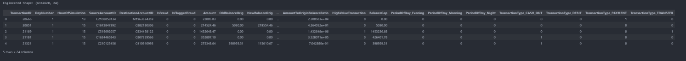
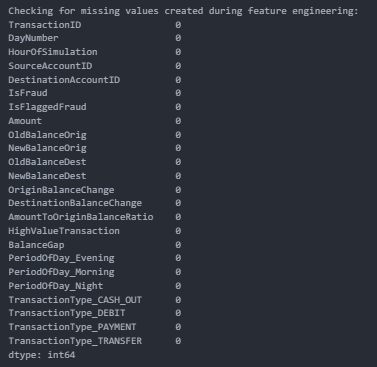

# Notebook 03: Feature Engineering

## Business Objective

Transform the cleaned analytical dataset into a machine learning-ready dataset by engineering meaningful features that improve fraud detection performance.

---

# Dataset Input

The cleaned analytical dataset generated during the Data Preparation phase was loaded for feature engineering.

## Dataset Information

- Records Processed: **6,362,620**
- Original Features: **14**

---

# Feature Engineering Process

### 1. Original Balance Change

Calculated the actual reduction in the sender's account balance.

**Business Purpose**

Measures how much money actually left the source account during a transaction.

---

### 2. Destination Balance Change

Calculated the increase in the receiver's account balance.

**Business Purpose**

Measures how much money was credited to the destination account.

---

### 3. Amount-to-Origin Balance Ratio

Calculated the percentage of the sender's available balance used in the transaction.

**Business Purpose**

Identifies unusually aggressive transactions where a large proportion of the account balance is transferred.

---

### 4. High Value Transaction Flag

Transactions above the **95th percentile** amount were flagged as high-value transactions.

**Business Purpose**

Highlights unusually large transactions that may require additional fraud investigation.

---

### 5. Balance Gap

Calculated the balance difference between the sender and receiver.

**Business Purpose**

Captures financial disparity between the sender and receiver, helping identify potentially suspicious fund transfers.

---

### 6. Machine Learning Encoding

Categorical variables were converted into numerical format using one-hot encoding.

The following variables were encoded:

- Period of Day
- Transaction Type

Boolean variables were also converted into integer values (0/1) to ensure compatibility with machine learning algorithms.

---

# SQL Output

## Engineered Dataset Preview

The engineered dataset expanded from **14 original features** to **24 machine learning-ready features** after business-driven feature engineering.

---

## Feature Validation

Validation confirmed that all engineered features were created successfully with **zero missing values**, ensuring data quality before preprocessing and model training.

---

# Business Interpretation

Feature engineering transformed raw transactional information into meaningful business variables representing customer behaviour, transaction characteristics, account balance movement, and financial risk indicators.

These engineered variables provide stronger predictive signals than the original dataset, enabling machine learning models to more effectively distinguish fraudulent transactions from legitimate payment activities.

---

# Key Insights

- Engineered multiple business-driven predictive features.
- Created balance movement and transaction behaviour indicators.
- Flagged high-value transactions using the 95th percentile threshold.
- Converted categorical variables into machine learning-compatible numerical features.
- Verified zero missing values after feature engineering.
- Expanded the dataset from **14** to **24** features.

---

# Business Recommendation

Business-oriented feature engineering is a critical stage of enterprise fraud analytics because well-designed features significantly improve model performance, interpretability, and scalability. These engineered variables establish a strong foundation for robust fraud detection models and enterprise-scale payment intelligence systems.

---