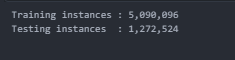
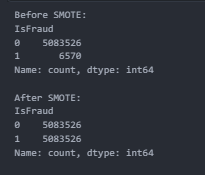
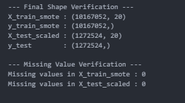
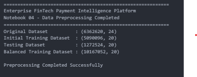

  # 🛠️ Data Preprocessing Results

  
  

 

# Notebook 04: Data Preprocessing

## 🎯 Business Objective

Prepare the feature-engineered dataset for machine learning by selecting predictive features, splitting the dataset into training and testing sets, standardizing numerical variables, balancing the training dataset using SMOTE, and exporting the final datasets for model training.

---

## 📥 Dataset Input

The feature-engineered dataset generated during the previous phase was loaded for preprocessing.

### 📊 Dataset Information
- Records Processed: **6,362,620**
- Total Features: **24**

---

## 🔄 Data Preprocessing Workflow

The following preprocessing steps were performed before machine learning model development.

---

### 1. Feature Selection
The target variable (**IsFraud**) was separated from the predictor variables.

The following identifier columns were excluded from model training:
- TransactionID
- SourceAccountID
- DestinationAccountID

This produced the final feature matrix used for machine learning.

---

### 2. Train-Test Split
The dataset was divided into:
- **80% Training Dataset**
- **20% Testing Dataset**

A **stratified split** was used to preserve the original fraud distribution in both datasets.

#### 📈 Output

---

### 3. Feature Scaling
Numerical variables were standardized using **StandardScaler**.

This ensures that features with large monetary values do not dominate the learning process and improves overall model performance.

---

### 4. SMOTE Class Balancing
Because fraudulent transactions represented only **0.13%** of the dataset, the training data was balanced using **SMOTE (Synthetic Minority Over-sampling Technique)**.

SMOTE was applied **only to the training dataset**, preventing data leakage into the testing dataset.

#### 📈 Output

---

### 5. Dataset Validation
After preprocessing, the datasets were validated to confirm:
- Correct dataset dimensions
- Successful preprocessing
- Zero missing values

#### 📈 Output

---

### 6. Final Preprocessing Summary
The final preprocessing pipeline completed successfully and exported all datasets required for machine learning model training.

#### 📈 Output

---

## 🧠 Business Interpretation

The preprocessing pipeline transformed the engineered analytical dataset into a machine learning-ready dataset through feature selection, dataset partitioning, feature standardization, class balancing, and validation.

Applying StandardScaler improved numerical consistency, while SMOTE corrected the severe fraud class imbalance without introducing data leakage. The exported datasets are now suitable for reliable machine learning model development and evaluation.

---

## 💡 Key Insights

- Selected relevant predictive features for fraud detection.
- Performed an **80/20 stratified train-test split**.
- Standardized numerical variables using **StandardScaler**.
- Balanced the minority fraud class using **SMOTE**.
- Preserved an untouched testing dataset for unbiased evaluation.
- Verified zero missing values after preprocessing.
- Exported finalized datasets for machine learning model training.

---

## ✅ Business Recommendation

A robust preprocessing pipeline is essential for enterprise fraud detection systems. Proper feature selection, feature scaling, balanced training data, and strict prevention of data leakage significantly improve model stability, predictive performance, and real-world deployment readiness.