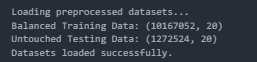
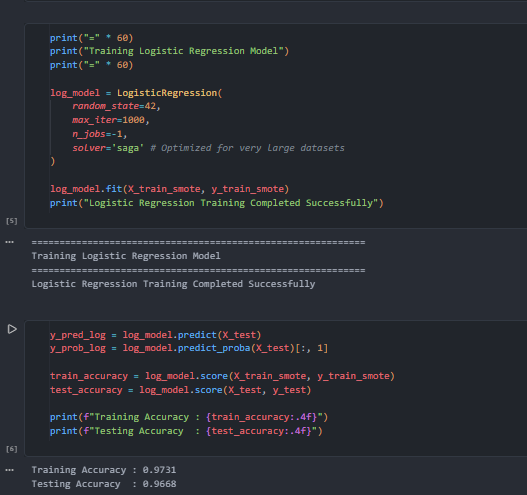
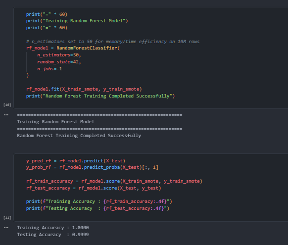
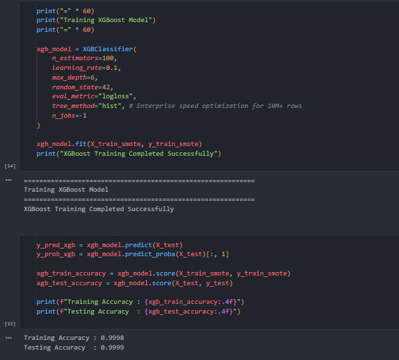
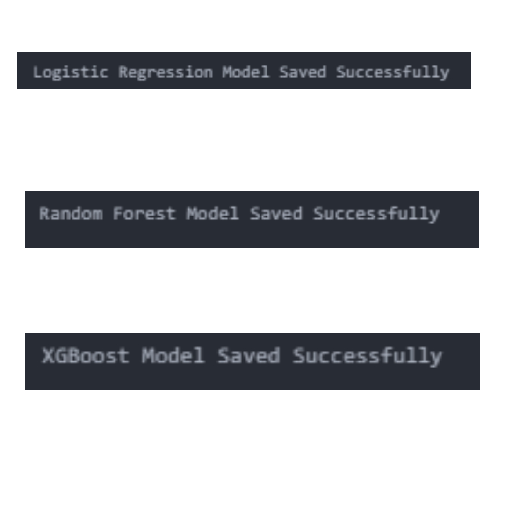

  # 🚀 Model Training Results

  
  

 

# Notebook 05 – Model Training Results

## 🎯 Objective

Train multiple machine learning models using the SMOTE-balanced training dataset for fraud detection and export the trained models for evaluation and deployment.

---

## 📥 Dataset Used

- Training Dataset (SMOTE Balanced)
- Testing Dataset (Original Distribution)
- Features: **20**
- Target Variable: `IsFraud`

### 🔍 Dataset Loading

**Observations:**
- Successfully loaded the balanced training dataset.
- Successfully loaded the untouched testing dataset.
- Predictor variables and target labels were correctly separated.
- Training data was prepared for model development.

---

# 📈 Model 1 – Logistic Regression

### 📊 Training Results

**Configuration:**
- Algorithm: Logistic Regression
- Solver: saga
- Maximum Iterations: 1000
- Random State: 42

### 📋 Performance
| Metric | Value |
|---------|------:|
| Training Accuracy | 97.31% |
| Testing Accuracy | 96.68% |

### 🧠 Business Interpretation
- Established a baseline classification model.
- Provides a simple and interpretable benchmark for fraud detection.
- Used as a reference model for comparison with advanced ensemble techniques.

---

# 🌲 Model 2 – Random Forest

### 📊 Training Results

**Configuration:**
- Algorithm: Random Forest
- Number of Trees: 50
- Random State: 42

### 📋 Performance
| Metric | Value |
|---------|------:|
| Training Accuracy | 100.00% |
| Testing Accuracy | 99.99% |

### 🧠 Business Interpretation
- Captures complex nonlinear fraud patterns.
- Ensemble learning significantly improves classification performance.
- Produces probability scores for fraud risk estimation.

---

# 🚀 Model 3 – XGBoost

### 📊 Training Results

**Configuration:**
- Algorithm: XGBoost
- Trees: 100
- Learning Rate: 0.1
- Maximum Depth: 6
- Evaluation Metric: Log Loss

### 📋 Performance
| Metric | Value |
|---------|------:|
| Training Accuracy | 99.98% |
| Testing Accuracy | 99.99% |

### 🧠 Business Interpretation
- Gradient boosting effectively models complex fraud behavior.
- Achieves excellent predictive performance while maintaining strong generalization.
- Selected as one of the primary candidate models for detailed evaluation.

---

# 📦 Model Export

### 💾 Saved Models

The following trained models were successfully exported:
- `LogisticRegression_Model.pkl`
- `RandomForest_Model.pkl`
- `XGBoost_Model.pkl`

These serialized models will be used during the Model Evaluation and Deployment phases.

---

# 📝 Notebook Summary

### ✅ Completed Tasks
- Loaded balanced training and untouched testing datasets.
- Trained Logistic Regression baseline model.
- Trained Random Forest ensemble model.
- Trained XGBoost gradient boosting model.
- Generated predictions and probability scores for all models.
- Exported trained models in `.pkl` format for future evaluation.

---

## ⏭️ Next Step

Proceed to **Notebook 06 – Model Evaluation**, where the trained models will be evaluated using:
- Confusion Matrix
- Precision
- Recall
- F1-Score
- ROC Curve
- Precision–Recall Curve
- Feature Importance
- SHAP Explainability
- Comparative Performance Analysis