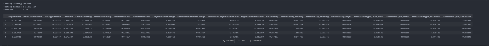
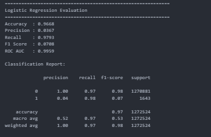
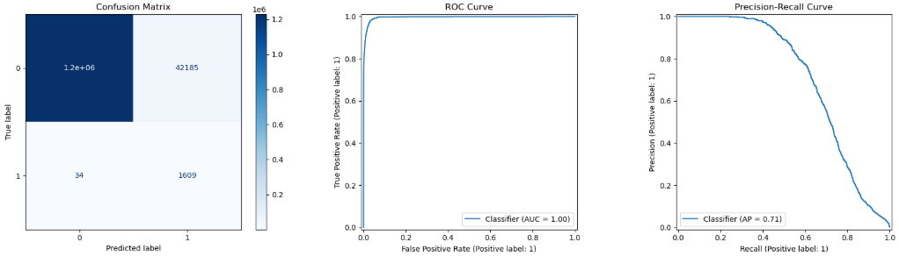
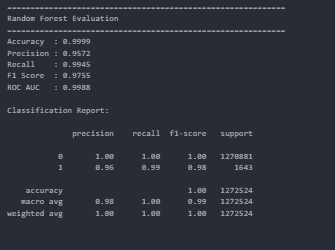
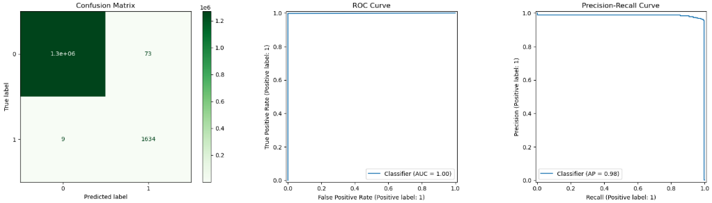
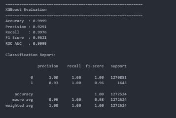
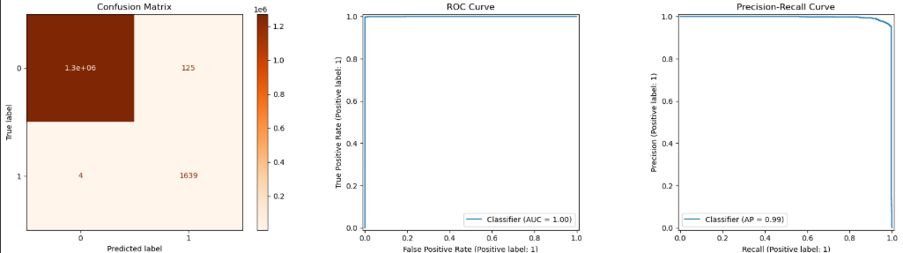
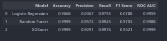
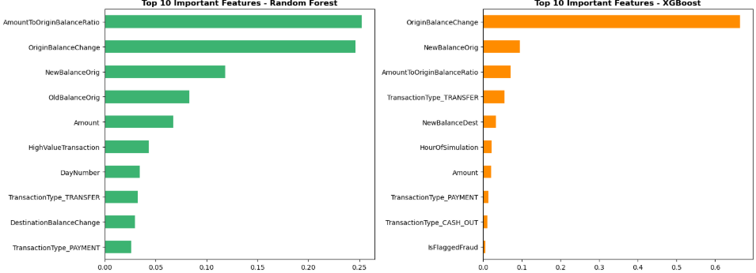

# Notebook 06 – Model Evaluation Results

## Objective

Evaluate Logistic Regression, Random Forest, and XGBoost models using multiple classification metrics, compare their predictive performance, and identify the best model for enterprise fraud detection.

---

# Dataset Used

Testing Dataset (Original Distribution)

- Samples: 1,272,524
- Features: 20
- Class Distribution: Original (Highly Imbalanced)

### Dataset Loading

**Observations**

- Successfully loaded testing dataset.
- Restored all trained machine learning models.
- Predictions and probability scores generated successfully.
- Evaluation performed on untouched testing data.

---

# Model 1 – Logistic Regression

## Performance Metrics

| Metric | Value |
|---------|------:|
| Accuracy | 96.68% |
| Precision | 3.67% |
| Recall | 97.93% |
| F1 Score | 7.08% |
| ROC AUC | 99.59% |

### Evaluation Charts

### Business Interpretation

- Excellent fraud recall.
- Detects almost every fraud transaction.
- Generates many false positives.
- Suitable as a high-recall baseline model.

---

# Model 2 – Random Forest

## Performance Metrics

| Metric | Value |
|---------|------:|
| Accuracy | 99.99% |
| Precision | 95.72% |
| Recall | 99.45% |
| F1 Score | 97.55% |
| ROC AUC | 99.88% |

### Evaluation Charts

### Business Interpretation

- Excellent precision and recall.
- Very low false alarms.
- Strong production-ready fraud detection model.
- Best balance between accuracy and robustness.

---

# Model 3 – XGBoost

## Performance Metrics

| Metric | Value |
|---------|------:|
| Accuracy | 99.99% |
| Precision | 92.91% |
| Recall | 99.76% |
| F1 Score | 96.21% |
| ROC AUC | 99.99% |

### Evaluation Charts

### Business Interpretation

- Outstanding fraud detection capability.
- Highest ROC AUC among all models.
- Extremely strong recall.
- Suitable for enterprise-scale fraud detection.

---

# Model Comparison

## Comparative Results

| Model | Accuracy | Precision | Recall | F1 Score | ROC AUC |
|--------|---------:|----------:|--------:|---------:|--------:|
| Logistic Regression | 96.68% | 3.67% | 97.93% | 7.08% | 99.59% |
| Random Forest | 99.99% | 95.72% | 99.45% | **97.55%** | 99.88% |
| XGBoost | 99.99% | 92.91% | **99.76%** | 96.21% | **99.99%** |

---

# Feature Importance Analysis

## Key Fraud Indicators

Top predictive variables include:

- Original Balance Change
- Amount-to-Origin Balance Ratio
- New Balance Origin
- Transaction Amount
- High Value Transaction
- Balance Gap

These variables contribute most significantly toward fraud detection decisions.

---

# Final Model Recommendation

**Recommended Production Model:** Random Forest

### Why Random Forest?

- Highest F1 Score (97.55%)
- Excellent Precision (95.72%)
- Excellent Recall (99.45%)
- Near-perfect ROC AUC
- Stable ensemble model
- Better balance between fraud detection and false positives
- Highly suitable for enterprise deployment

---

# Notebook Summary

Completed Tasks

- Loaded trained machine learning models.
- Evaluated three fraud detection algorithms.
- Generated Confusion Matrix, ROC Curve, and Precision–Recall Curve.
- Compared all model performance metrics.
- Identified key fraud-driving features.
- Selected Random Forest as the recommended production model.

---

## Next Step

Proceed to **Notebook 07 – Model Deployment Preparation**, where the selected Random Forest model will be packaged and prepared for enterprise deployment.