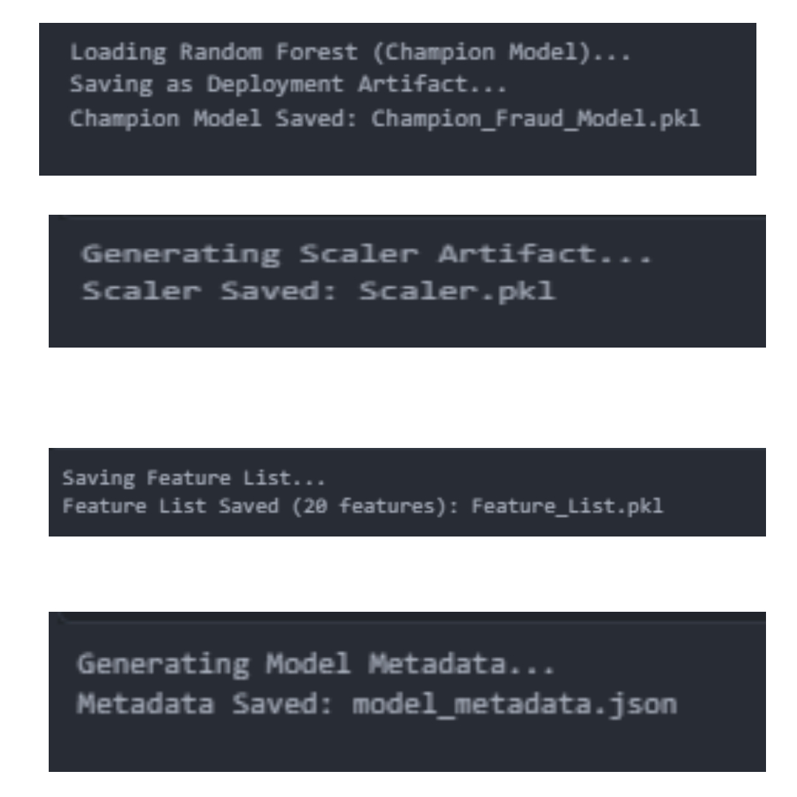
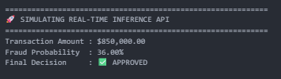

# Notebook 07 – Model Deployment Preparation Results

## Objective

Package the champion fraud detection model together with all required deployment artifacts, enabling real-time fraud prediction in a production environment.

---

# Deployment Artifacts

The final production assets were successfully generated.

### Generated Files

| Artifact | Purpose |
|----------|---------|
| Champion_Fraud_Model.pkl | Final production Random Forest model |
| Scaler.pkl | Feature standardization during inference |
| Feature_List.pkl | Maintains feature ordering consistency |
| model_metadata.json | Stores model information and performance metrics |

---

# Real-Time Fraud Prediction

A simulated payment transaction was passed through the deployment pipeline.

### Inference Pipeline

1. Load deployment artifacts.
2. Receive incoming transaction.
3. Convert transaction into model feature format.
4. Apply feature scaling.
5. Generate fraud probability.
6. Predict fraud status.
7. Return final decision.

### Sample Prediction

| Field | Value |
|-------|------|
| Transaction Amount | \$850,000 |
| Fraud Probability | 36.00% |
| Final Decision | Approved |

---

# Deployment Readiness

The deployment package now contains:

- Champion Random Forest model
- Feature scaler
- Feature list
- Model metadata
- Real-time inference pipeline

These artifacts can be integrated into REST APIs, microservices, or enterprise payment processing systems.

---

# Notebook Summary

Completed Tasks

- Packaged the production-ready Random Forest model.
- Generated deployment artifacts.
- Created reusable feature scaler.
- Saved feature ordering for inference consistency.
- Exported model metadata.
- Demonstrated a complete end-to-end real-time fraud prediction workflow.

---

## Next Step

Proceed to **Notebook 08 – Model Explainability (SHAP)** to interpret model predictions and identify the most influential fraud indicators.