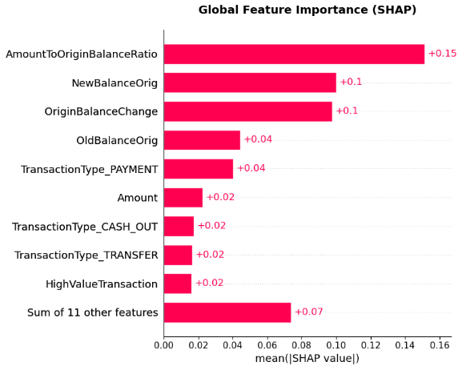
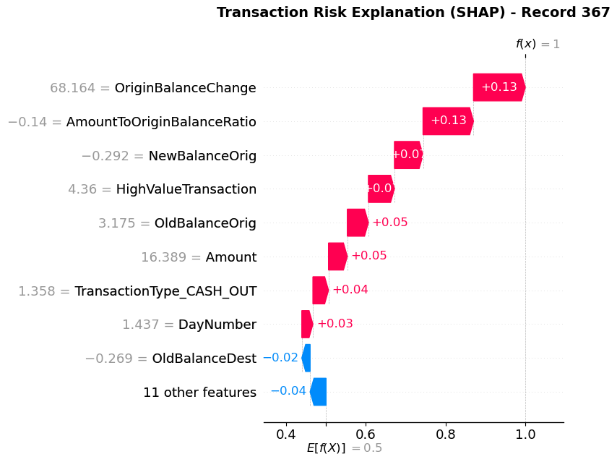

  # 🔍 Model Explainability (SHAP) Results

  
  

 

# Notebook 08 – Model Explainability (SHAP)

## 🎯 Objective

Interpret the predictions made by the champion Random Forest fraud detection model using SHAP (SHapley Additive exPlanations). Analyze both global feature importance and local transaction-level explanations to improve model transparency and business interpretability.

---

## 🛠️ Key Activities

- Loaded the champion Random Forest model.
- Loaded the testing dataset.
- Generated SHAP values for prediction explanations.
- Analyzed global feature importance using SHAP.
- Explained an individual fraud prediction using a SHAP Waterfall plot.
- Identified the strongest contributors influencing fraud detection.

---

## 📊 Results

### 1. Global SHAP Feature Importance

The global SHAP analysis ranks the most influential features across the entire dataset. Features related to transaction amount and balance movements contribute most significantly to fraud prediction.

---

### 2. Local Transaction Explanation

A SHAP Waterfall plot was generated for an individual fraudulent transaction, illustrating how each feature increased or decreased the predicted fraud risk. This provides complete transparency into the model's decision-making process.

---

## 🧠 Business Insights

- SHAP improves model transparency by explaining individual fraud predictions.
- Global SHAP analysis identifies the strongest fraud indicators used by the model.
- Local SHAP explanations demonstrate why a specific transaction was classified as fraudulent.
- Explainable AI increases stakeholder confidence and supports fraud investigation teams.
- SHAP explanations enable analysts to validate predictions before taking business actions.

---

## 📦 Deliverables

- Global SHAP Feature Importance Visualization
- Local Transaction SHAP Waterfall Explanation
- Business Interpretation of Model Decisions
- Explainable AI Documentation