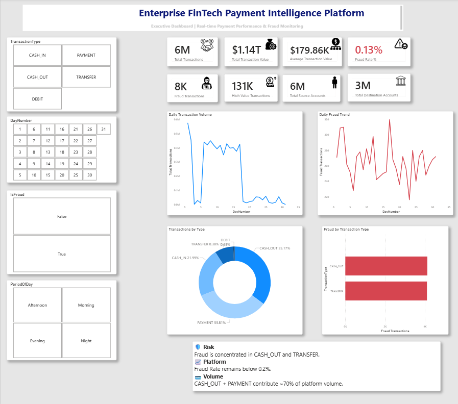
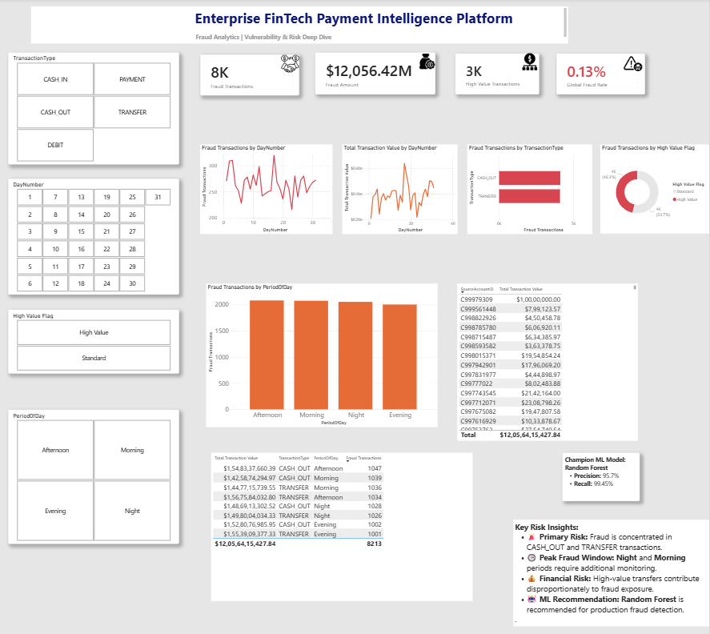
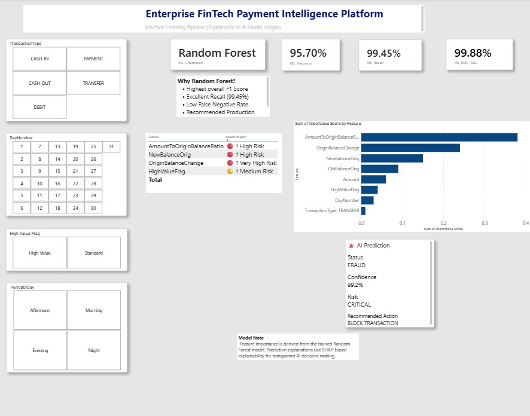
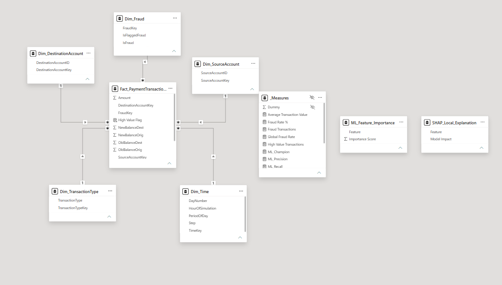

# Enterprise FinTech Payment Intelligence Platform
# Phase 5 – Business Intelligence (Power BI)
# Dashboard Results

---

# Executive Dashboard

## Business Objective

Provide an executive-level overview of payment performance, transaction volume, fraud activity, and operational KPIs to support strategic decision-making.

### Dashboard Preview

### Key KPIs

- Total Transactions
- Total Transaction Value
- Average Transaction Value
- Fraud Rate
- Fraud Transactions
- High Value Transactions
- Total Source Accounts
- Total Destination Accounts

### Business Insights

- The platform processed over **6 million payment transactions**.
- Overall fraud rate remained extremely low at **0.13%**.
- CASH_OUT and PAYMENT transactions contributed the largest share of platform activity.
- Executive KPIs provide continuous visibility into platform health and fraud exposure.

### Business Value

Provides business leaders with a real-time operational overview for monitoring platform performance, transaction trends, and fraud risk.

---

# Fraud Analytics Dashboard

## Business Objective

Support fraud analysts by identifying fraud patterns, monitoring suspicious transactions, and prioritizing high-risk investigations.

### Dashboard Preview

### Key KPIs

- Fraud Transactions
- Fraud Amount
- High Value Fraud Transactions
- Global Fraud Rate

### Business Insights

- Fraud activity is primarily concentrated in **CASH_OUT** and **TRANSFER** transactions.
- High-value transactions contribute disproportionately to overall fraud exposure.
- Fraud patterns vary across different periods of the day.
- Interactive filtering enables rapid fraud investigation and operational analysis.

### Business Value

Enables fraud operations teams to quickly identify suspicious payment behavior and prioritize investigation efforts.

---

# Explainable AI & Model Insights

## Business Objective

Provide transparent machine learning insights by presenting the champion fraud detection model, feature importance, and explainable AI outputs.

### Dashboard Preview

### Model Performance

- Champion Model: Random Forest
- Precision: 95.70%
- Recall: 99.45%
- ROC-AUC: 99.88%

### Key Insights

- **AmountToOriginalBalanceRatio** is the most influential fraud indicator.
- **OriginBalanceChange** significantly contributes to fraud prediction.
- SHAP-based explainability improves model transparency and interpretability.
- Random Forest provides the strongest balance between precision, recall, and production readiness.

### Business Value

Improves stakeholder trust by providing interpretable AI predictions suitable for enterprise fraud detection systems.

---

# Enterprise Data Model

## Business Objective

Build a scalable semantic model that supports interactive analytics while following enterprise Power BI best practices.

### Data Model Preview

### Star Schema Design

**Fact Table**

- Fact_PaymentTransactions

**Dimension Tables**

- Dim_Time
- Dim_TransactionType
- Dim_SourceAccount
- Dim_DestinationAccount
- Dim_Fraud

**Machine Learning Tables**

- ML_Feature_Importance
- SHAP_Local_Explanation

### Data Model Highlights

- Centralized Star Schema improves reporting performance.
- One-to-many relationships enable efficient filtering across dashboards.
- Machine Learning tables remain intentionally disconnected because they support Explainable AI visuals only.
- Clean semantic modeling improves scalability, maintainability, and dashboard performance.

### Business Value

Provides a robust enterprise-grade analytical foundation capable of supporting executive reporting, fraud analytics, and explainable AI within a unified Power BI solution.

---

# Overall Business Outcome

The Business Intelligence solution integrates enterprise analytics, fraud monitoring, and explainable AI into a single interactive reporting platform.

- Executives monitor payment platform performance through KPI-driven dashboards.
- Fraud analysts investigate suspicious transactions using operational analytics.
- Machine learning insights provide transparent and explainable fraud predictions.
- The Star Schema semantic model ensures scalable, maintainable, and high-performance reporting.

Together, these dashboards transform raw payment transaction data into actionable business intelligence, enabling faster, data-driven decision-making across executive, operational, and analytical teams.